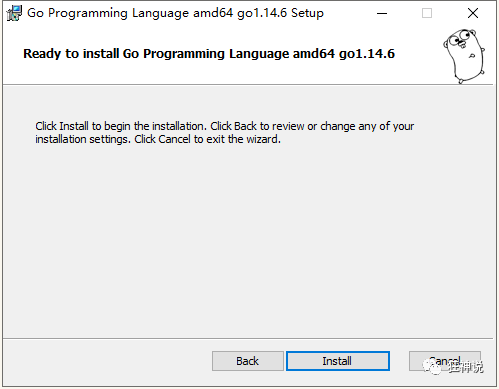
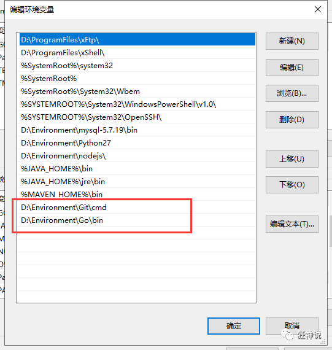

# Go环境搭建

## 下载安装Go

> 云原生时代，Go语言或将成为新的主力开发语言，所以我们有必要学习并掌握它。第一件事情，就是把环境搭建起来，大家可以跟着步骤一起将Go语言开发环境搭建起来哦。

地址：https://studygolang.com/dl

1、根据系统来选择下载包。


2、我这里是Window，所以直接下载windows的安装包来安装。





3、在控制台窗口输入“go version”可查看Go版本，检测是否安装成功。


4、配置环境变量。Go需要一个安装目录，还需要一个工作目录。即GOROOT、和GOPATH。

GOROOT即为GO的安装目录。


GOPATH即为存储Go语言项目的路径，可以自己进行设值，我放在了**GoWorks**自己建的，里面需要包含src、pkg、bin三个目录。

如果你下载的开发工具没有这些识别项，需要检查环境变量是否配置了Goworks。


如果是安装包安装的，系统环境变量自动配置的，如果压缩包安装，需要在PATH配置Go的命令。



打开控制台，输入命令**go env**查看是否配置成功。


ok，到此，Go安装完成。

> 了解：GOPATH的目录结构（未来会慢慢理解）

一个Go语言项目的目录一般包含以下三个子目录：

 - src 目录：放置项目和库的源文件；
 - pkg 目录：放置编译后生成的包/库的归档文件；
 - bin 目录：放置编译后生成的可执行文件。

三个目录中我们需要重点关注的是 src 目录，其他两个目录了解即可，下面来分别介绍一下这三个目录。

**src 目录**

用于以包（package）的形式组织并存放 Go 源文件，这里的包与 src 下的每个子目录是一一对应。例如，若一个源文件被声明属于 log 包，那么它就应当保存在 src/log 目录中。

并不是说 src 目录下不能存放 Go 源文件，一般在测试或演示的时候也可以把 Go 源文件直接放在 src 目录下，但是这么做的话就只能声明该源文件属于 main 包了。正常开发中还是建议大家把 Go 源文件放入特定的目录中。

包是Go语言管理代码的重要机制，其作用类似于Java中的 package 和 C/C++ 的头文件。Go 源文件中第一段有效代码必须是package <包名> 的形式，如 package main。

另外需要注意的是，Go语言会把通过go get 命令获取到的库源文件下载到 src 目录下对应的文件夹当中。

**pkg 目录**

用于存放通过go install 命令安装某个包后的归档文件。归档文件是指那些名称以“.a”结尾的文件。

该目录与 GOROOT 目录（也就是Go语言的安装目录）下的 pkg 目录功能类似，区别在于这里的 pkg 目录专门用来存放项目代码的归档文件。

编译和安装项目代码的过程一般会以代码包为单位进行，比如 log 包被编译安装后，将生成一个名为 log.a 的归档文件，并存放在当前项目的 pkg 目录下。

**bin 目录**

与 pkg 目录类似，在通过go install 命令完成安装后，保存由 Go 命令源文件生成的可执行文件。在类 Unix 操作系统下，这个可执行文件的名称与命令源文件的文件名相同。而在 Windows 操作系统下，这个可执行文件的名称则是命令源文件的文件名加 .exe 后缀。


> 总结

1、找到Go语言的下载地址

2、安装Go语言环境

3、配置环境变量

4、GoWorks 配置

5、go version 查看版本   |     go env 查看所有的go环境变量

6、简单了解GoWorks 下面的三个目录作用。

## 下载开发工具 GoLand

下载地址：https://www.jetbrains.com/go/download/download-thanks.html


下载完成后，直接傻瓜式一路向下安装即可。

和装IDEA是一样的，好啦，环境搭建完毕，就可以开始Go语言的开发啦。

打不开的，激活

1、淘宝购买账号，9.9 一年

2、网上找激活码、一键激活   一个月

3、官方认证账号购买，很贵，但是正版！

## HelloWorld详解

**package（创建包）**

Go语言以“包”作为管理单位，每个 Go 源文件必须先声明它所属的包，所以我们会看到每个 Go 源文件的开头都是一个 package 声明，格式如下：

`package name`

其中 package 是声明包名的关键字，name 为包的名字。和包同名，除了入口文件，main 固定的写法

Go语言的包与文件夹是一一对应的，它具有以下几点特性：

- 一个目录下的同级文件属于同一个包。
- **包名可以与其目录名不同。**

main 包是Go语言程序的入口包，一个Go语言程序必须有且仅有一个 main 包。如果一个程序没有 main 包，那么编译时将会出错，无法生成可执行文件。

**import（导入包）**

在包声明之后，是 import 语句，用于导入程序中所依赖的包，导入的包名使用双引号""包围，格式如下：

`import "name"`

其中 import 是导入包的关键字，name 为所导入包的名字。

代码第 4 行导入了 fmt 包，这行代码会告诉 Go 编译器，我们需要用到 fmt 包中的函数或者变量等，fmt 包是Go语言标准库为我们提供的，用于格式化输入输出的内容（类似于C语言中的 stdio.h 头文件），类似的还有 os 包、io 包等，后面我们会详细介绍。

另外有一点需要注意，导入的包中不能含有代码中没有使用到的包，否则Go编译器会报编译错误，例如 imported and not used: "xxx"，"xxx" 表示包名。

也可以使用一个 import 关键字导入多个包，此时需要用括号( )将包的名字包围起来，并且每个包名占用一行，也就是写成下面的样子：

```
import(
    "name1"
    "name2"
)
```

**main 函数**

代码的第 7 行创建了一个 main 函数，它是Go语言程序的入口函数，也即程序启动后运行的第一个函数。main 函数只能声明在 main 包中，不能声明在其他包中，并且，一个 main 包中也必须有且仅有一个 main 函数。
C/C++ 程序的入口函数也是 main()，一个 C/C++ 程序有且只能有一个 main() 函数。

main 函数是自定义函数的一种，在Go语言中，所有函数都以关键字 func 开头的，定义格式如下所示：

```
func 函数名 (参数列表) (返回值列表){
    函数体
}
```

格式说明如下：

- 函数名：由字母、数字、下画线_组成，其中，函数名的第一个字母不能为数字，并且，在同一个包内，函数名称不能重名。
- 参数列表：一个参数由参数变量和参数类型组成，例如 func foo( a int, b string )。
- 返回值列表：可以是返回值类型列表，也可以是参数列表那样变量名与类型的组合，函数有返回值时，必须在函数体中使用 return 语句返回。
- 函数体：能够被重复调用的代码片段。

注意：Go语言函数的左大括号{必须和函数名称在同一行，否则会报错。

**打印 Hello World**

代码的第 8 行 fmt.Println("Hello World!") 中，Println 是 fmt 包中的一个函数，它用来格式化输出数据，比如字符串、整数、小数等，类似于C语言中的 printf 函数。这里我们使用 Println 函数来打印字符串，也就是( )里面使用""包裹的部分。

注意，Println 函数打印完成后会自动换行，ln是 line 的缩写。

点号.是Go语言运算符的一种，这里表示调用 fmt 包中的 Println 函数。

另外，代码 fmt.Println("Hello World!") 的结尾，不需要使用;来作为结束符，Go 编译器会自动帮我们添加，当然，在这里加上;也是可以的。

## 编译和运行

Go语言是编译型的静态语言（和C语言一样），所以在运行Go语言程序之前，先要将其编译成二进制的可执行文件。

可以通过Go语言提供的go build或者go run命令对Go语言程序进行编译：

- go build 命令可以将Go语言程序代码编译成二进制的可执行文件，但是需要我们手动运行该二进制文件；
- go run 命令则更加方便，它会在编译后直接运行Go语言程序，编译过程中会产生一个临时文件，但不会生成可执行文件，这个特点很适合用来调试程序。


因为之前我们已经配置好了环境变量，所以可以直接使用 Windows 自带的命令行工具（也叫 CMD 窗口或者命令提示符）来编译Go语言程序。微软后来对命令行工具进行了一次升级，并更名为 Powershell，power 是更加强大的意思。

> go build 命令

go build 命令用来启动编译，它可以将Go语言程序与相关依赖编译成一个可执行文件，其语法格式如下。

`go build fileName`

其中 fileName 为所需要的参数，可以是一个或者多个 Go 源文件名（当有多个参数时需要使用空格将两个相邻的参数隔开），也可以省略不写。

使用 go build 命令进行编译时，不同参数的执行结果也是不同的。

1) 当参数不为空时

如果 fileName 为同一 main 包下的所有源文件名（可能有一个或者多个），编译器将生成一个与第一个 fileName 同名的可执行文件（如执行 go build abc.go def.go ... 会生成一个 abc.exe 文件）；如果 fileName 为非 main 包下的源文件名，编译器将只对该包进行语法检查，不生成可执行文件。

2) 当参数为空时

如果当前目录下存在 main 包，则会生成一个与当前目录名同名的“目录名.exe”可执行文件（如在 hello 目录中执行 go build 命令时，会生成 hello.exe 文件）；如果不存在 main 包，则只对当前目录下的程序源码进行语法检查，不会生成可执行文件。

例子：`go build .\hello.go`

go build命令后面的参数中，.\表示当前目录。在Windows 系统中，当前目录使用.\表示；在类 Unix 系统（例如 Linux、MacOS 等）中，当前目录使用./表示。

注意，这里的go build 命令中 .\可以省略不写，不会影响编译。

另外，go build 命令只有在执行出错的情况下才会有返回信息，执行成功的话是没有返回信息的，但是会在当前目录生成一个与 main 包文件同名的 .exe 可执行文件，如下图所示。

> go run 命令

除了使用go build命令外，Go语言还为我们提供了go run命令，go run命令将编译和执行指令合二为一，会在编译之后立即执行Go语言程序，但是不会生成可执行文件。

go run 命令的语法格式如下：

`go run fileName`

其中 fileName 为所需要的参数，参数必须是同一 main 包下的所有源文件名，并且不能为空。

例子：`go run hello.go`

可以看到第 1 行的go run 命令执行后，直接在第 2 行输出了程序的运行结果。

go build 命令和 go run 命令还有很多其他的编译方法，我们将在后面为大家详细介绍。

## 常用的几种Print方式

> Print

```
输出到控制台(不接受任何格式化，它等价于对每一个操作数都应用 %v)
fmt.Print(str)
```

> Println

```
输出到控制台并换行
fmt.Println(tmp)
```

> Printf

```go
var a int = 1
var b int = 2
var c int = 3
只可以打印出格式化的字符串。只可以直接输出字符串类型的变量（不可以输出整形变量和整形 等）
fmt.Printf("%d",a)
fmt.Printf("a = %d, b = %d, c = %d\n", a, b, c)
```

在 Printf中，有一些常用的格式化占位符，我们在这里列出一下 ：

- %v 以默认的方式打印变量的值
- %T 打印变量的类型
- %s 正常输出字符串
- %t 打印true或false
- %p 带0x的指针
- %d 整型
- %#p 不带0x的指针
- %o 不带零的八进制
- %#o 带零的八进制
- %x 小写的十六进制
- %X 大写的十六进制
- %#x 带0x的十六进制
- %U 打印Unicode字符
- %#U 打印带字符的Unicode
- %b 打印整型的二进制
- %q 字符串带双引号，字符串中的引号带转义符
- %f (=%.6f) 6位小数点
- %e (=%.6e) 6位小数点（科学计数法）
- %g 用最少的数字来表示
- %.3g 最多3位数字来表示
- %.3f 最多3位小数来表示


## Go语言常用标准库

Go语言的标准库以包的方式提供支持，下表列出了Go语言标准库中常见的包及其功能。

| Go语言标准库包名 | 功  能                                                       |
| ---------------- | ------------------------------------------------------------ |
| bufio            | 带缓冲的 I/O 操作                                            |
| bytes            | 实现字节操作                                                 |
| container        | 封装堆、列表和环形列表等容器                                 |
| crypto           | 加密算法                                                     |
| database         | 数据库驱动和接口                                             |
| debug            | 各种调试文件格式访问及调试功能                               |
| encoding         | 常见算法如 JSON、XML、Base64 等                              |
| flag             | 命令行解析                                                   |
| fmt              | 格式化操作                                                   |
| go               | Go语言的词法、语法树、类型等。可通过这个包进行代码信息提取和修改 |
| html             | HTML 转义及模板系统                                          |
| image            | 常见图形格式的访问及生成                                     |
| io               | 实现 I/O 原始访问接口及访问封装                              |
| math             | 数学库                                                       |
| net              | 网络库，支持 Socket、HTTP、邮件、RPC、SMTP 等                |
| os               | 操作系统平台不依赖平台操作封装                               |
| path             | 兼容各操作系统的路径操作实用函数                             |
| plugin           | Go 1.7 加入的插件系统。支持将代码编译为插件，按需加载（一个完整的go环境是很大也，只放需要的部分） |
| reflect          | 语言反射支持。可以动态获得代码中的类型信息，获取和修改变量的值 |
| regexp           | 正则表达式封装                                               |
| runtime          | 运行时接口                                                   |
| sort             | 排序接口                                                     |
| strings          | 字符串转换、解析及实用函数                                   |
| time             | 时间接口                                                     |
| text             | 文本模板及 Token 词法器                                      |


