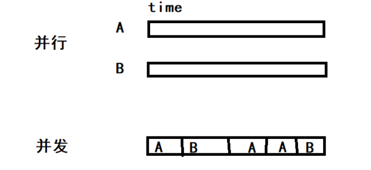
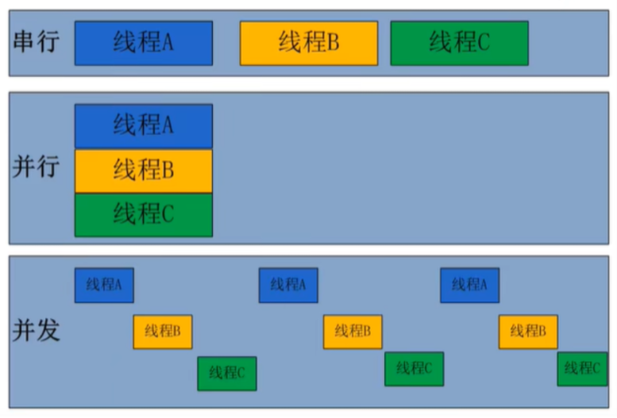
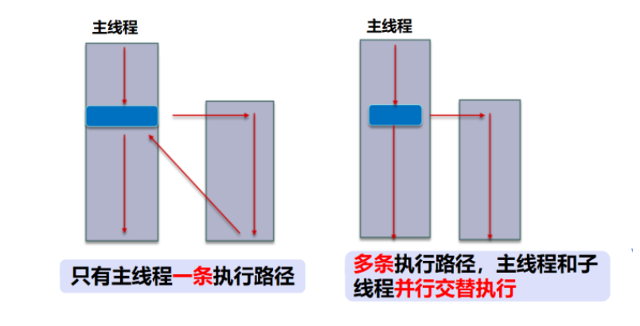
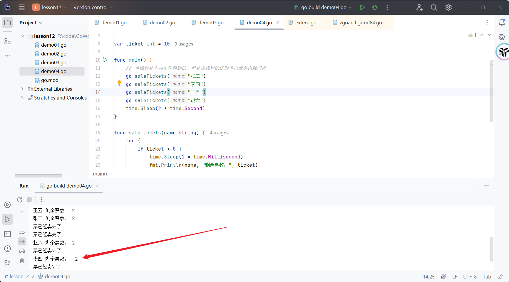

# Groutine

## 进程、线程、协程

**程序**：指令和数据的集合。本身没有任何含义，是一个静态的概念。

**进程**：QQ.exe、微信.exe...一个一个的程序，执行起来之后就会开启一个进程。是执行程序的一个过程，它是动态的概念

- 是系统分配资源的单位

**线程**：一个进程中可以有多个线程，是并行的。一个进程中至少要包含一个线程。main主线程

- 线程是CPU调度和执行的单位
- 一个线程的话直接执行即可
- 多个线程：CPU如何去调度执行？一个CPU也是可以跑多个线程的
  - 并发
  - 并行



- **在代码级别中的所谓多线程并发处理问题。模拟出来的**。实际上还是只有一个CPU
- **真正的多线程是指的拥有多个CPU、多核**
- 如果是模拟出来的多线程、即在**一个CPU的情况下，在同一个时间点，只能执行一个线程的代码**。
- 因为执行的速度很快，所以就有了同时在执行的一种错句。

**并行真的就比并发快吗？**

- 并行运行的组件考虑到多个线程之间的通信问题，这种跨CPU通信问题是开销比较高的，所以并行不一定快



**协程Goroutine**

协程是一种用户态的**轻量级线程，又称微线程**，英文名Coroutine,**协程的调度完全由用户控制**。人们通常将协程和子程序(函数)比较着理解。

就好比是启动了一个函数，单次执行完毕它。不影响我们main线程的执行。

子程序调用总是一个入口，一次返回，一旦退出即完成了子程序的执行。

与传统的系统级线程和进程相比，**协程的最大优势在于其"轻量级”**，**可以轻松创建上百万个而不会导致系统资源衰竭**，而线程和进程通常最多也不能超过1万的。这也是协程也叫轻量级线程的原因。

补充：Go语言流行的另一个原因，高并发的问题。高效！

**Go语言对于并发的实现是靠协程，Goroutine**

## 多线程

普通方法调用：就是串行

```go
main(){
	test1()
	test2()
	test3()
}
```

多线程执行

```go
// 四个线程同时执行：main、test1、test2、test3
main(){
	go test1()
	go test2()
	go test3()
}
```



## Goroutine

Go中使用Goroutine来实现**并发**concurrently 

**Goroutine是Go语言特有的名词。**区别于进程Process,线程Thread, 协程Goroutine, 因为Go语言的创造者们觉得和他们是有所区别的，**所以专门创造了Goroutine** 

Goroutine是与其他函数或方法同时运行的函数或方法。Goroutines可以被认为是轻量级的线程。与线程相比，**创建Goroutine的成本很小，它就是一段代码，一个函数入口**。以及在堆上为其分配的一个堆栈(**初始大小为4K**,会随着程序的执行自动增长删除)。因此它非常廉价，Go应用程序可以轻松并发运行数千个Goroutines 


> **在go语言中使用 goroutine，在调用函数或者方法前面加上 go 关键字即可**。

```go
// 方法调用
main(){
    test()
}
// goroutine 
main(){
   go test()
}
```

Goroutine

```go
package main

import "fmt"

func main() {
	// goroutine: 和普通方法调用完全不同，多线程并发执行的，快速交替
	go hello()
	for i := 0; i < 100; i++ {
		fmt.Println("main ", i)
	}
}

func hello() {
	for i := 0; i < 100; i++ {
		fmt.Println("hello ", i)
	}
}
```

我们需要了解Goroutine的规则

1、当新的Goroutine开始时， Goroutine调用立即返回。与函数不同，go不等待Goroutine执行结束

2、当Goroutine调用，并且Goroutine的任何返回值被忽略之后，go立即执行到下一行代码

3、main的Goroutine应该为其他的Goroutines执行。**如果main的Goroutine终止了，程序将被终止**，而其他Goroutine将不会运行，简单说就是**main函数结束，程序也就结束了，不会再执行**。

> 主Goroutine - mian（补充了解）

封装main函数的goroutine称为主goroutine。

主goroutine所做的事情并不是执行main函数那么简单。它首先要做的是:设定每一个goroutine所能申请的栈空间的最大尺寸。在32位的计算机系统中此最大尺寸为250MB,而在64位的计算机系统中此尺寸为1GB。如果有某个goroutine的栈空间尺寸大于这个限制，那么运行时系统就会引发一个栈溢出(stack overflow)的运行时恐慌。随后，这个go程序的运行也会终止。

此后，主goroutine会 进行一系列的初始化工作，涉及的工作内容大致如下:

1、创建一个特殊的defer语句，用于在主goroutine退出时做必要的善后处理。因为主goroutine也可能非正常的结束
2、启动专用于在后台清扫内存垃圾的goroutine,并设置GC可用的标识. 
3、执行main包中所引用包下的init函数
4、执行main函数

执行完main函数后，它还会检查主goroutine是否引发了运行时恐慌，并进行必要的处理。

程序运行完毕后，主goroutine会结束自己以及当前进程的运行。

## runtime包

常用方法

```go
package main

import (
    "fmt"
    "runtime"
    "time"
)

func main() {
    // 终止程序
    go func() {
       fmt.Println("start")
       runtime_test()
       fmt.Println("end")
    }()

    time.Sleep(3 * time.Second)
}

func runtime_test() {
    defer fmt.Println("test defer")
    runtime.Goexit()   // 终止当前的goroutine
    fmt.Println("test")
}

// 获取系统信息
func runtime1() {
    // 获取GOROOT目录：找到指定目录可以存放一些项目信息
    fmt.Println("GOROOT:", runtime.GOROOT())
    // 获取操作系统  Windows    判断盘符字符。"\\"或者"/"
    fmt.Println("System", runtime.GOOS)
    // 获取CPU数量 可以尝试做一些系统优化，开启更大的栈空间
    fmt.Println("NumCPU", runtime.NumCPU())
}

// 调度goroutine
func runtime2() {
    go func() {
       for i := 0; i < 5; i++ {
          fmt.Println("goroutine", i)
       }
    }()
    for i := 0; i < 5; i++ {
       // 使用礼让的方法：让出时间片，让其他的goroutine先执行
       // 代码是无法控制CPU的，CPU是随机分配的，只是相对来说，可以让一下，但是不一定能够成功
       runtime.Gosched()
       fmt.Println("main", i)
    }
}
```

## 多线程会遇到的问题

### 临界资源的安全问题

```go
package main

import (
    "fmt"
    "time"
)

func main() {
    // 临界资源：多个协程共享的变量，会导致程序结果未知
    a := 1

    go func() {
       a = 2
       fmt.Println("goroutine a:", a)
    }()
    a = 3
    time.Sleep(1 * time.Second)
    fmt.Println("main a:", a)
}
```

> 售票问题

```go
package main

import (
    "fmt"
    "time"
)

var ticket int = 10

func main() {
    // 单线程是不会出现问题的，但是多线程的资源争抢就会出现问题
    go saleTickets("张三")
    go saleTickets("李四")
    go saleTickets("王五")
    go saleTickets("赵六")
    time.Sleep(2 * time.Second)
}

func saleTickets(name string) {
    for {
       if ticket > 0 {
          time.Sleep(1 * time.Millisecond)
          fmt.Println(name, "剩余票数：", ticket)
          ticket--
       } else {
          fmt.Println("票已经卖完了")
          break
       }
    }
}
```

发现结果和预想中的不同，所以就存在安全问题



## sync包 - 锁

要想解决临界资源安全的问题，很多编程语言的解决方案都是同步。**通过上锁的方式，某一时间段，只能允许一个goroutine来访问这个共享数据，当前goroutine访问完毕， 解锁后，其他的goroutine才 能来访问**。

我们可以借助于sync包下的锁操作。 synchronization 

但是实际上，在Go的并发编程中有一句很经典的话：**不要以共享内存的方式去通信:锁，而要以通信的方式去共享内存。**

```
共享内存的方式
锁：多个线程拿的是同一个钥匙，go语言不建议使用锁机制来解决。不要以共享内存的方式去通信

而要以通信的方式去共享内存 go语言更建议我们使用 chan 来解决安全问题。（后面会学）
```

在Go语言中并不鼓励用锁保护共享状态的方式，在不同的Goroutine中分享信息(以共享内存的方式去通信)。而是**鼓励通过channeI将共享状态或共享状态的变化在各个Goroutine之间传递(以通信的方式去共享内存)**，这样同样能像用锁一样保证在同一的时间只有一个Goroutine访问共享状态。

当然，在主流的编程语言中为了保证多线程之间共享数据安全性和一致性，都会提供一套基本的同步工具集，如锁，条件变量，原子操作等等。**Go语言标准库也毫不意外的提供了这些同步机制，使用方式也和其他语言也差不多**。

### 解决临界资源的安全问题

其他语言的解决方式1

```go
package main

import (
    "fmt"
    "sync"
    "time"
)

// 定义一个全局变量，票的库存为10
var ticket int = 10

// 定义一个锁    Mutex  锁头
var mutex sync.Mutex

func main() {
    // 单线程是不会出现问题的，但是多线程的资源争抢就会出现问题
    go saleTickets("张三")
    go saleTickets("李四")
    go saleTickets("王五")
    go saleTickets("赵六")
    time.Sleep(10 * time.Second)
}

func saleTickets(name string) {
    for {
       // 在拿到共享资源之前先上锁
       mutex.Lock()
       if ticket > 0 {
          time.Sleep(1 * time.Millisecond)
          fmt.Println(name, "剩余票数：", ticket)
          ticket--
          
       } else {
          fmt.Println("票已经卖完了")
          // 票卖完也解锁
          mutex.Unlock()
          break
       }
       // 使用完就解锁
       mutex.Unlock()
    }

}
```

### 同步等待组

其他语言的解决方式2

```go
package main

import (
    "fmt"
    "sync"
)

// waitgroup

var wg sync.WaitGroup

func main() {
    // 因为下面要开启两个协程，所以我们就开启两个等待
    // wg.Add(2) 判断还有几个协程、计数 num=2
    // wg.Done() 告知我已经结束 num - 1
    wg.Add(2)
    go test1()
    go test2()
    // 理想状态：所有协程执行完毕之后自动停止，而不是我们手动加上Sleep
    //time.Sleep(3 * time.Second)

    // 等待wg归零，才会继续向下执行
    wg.Wait()
}

func test1() {
    // test1 执行完毕
    defer wg.Done()
    for i := 0; i < 10; i++ {
       fmt.Println("test1-i:", i)
    }
}
func test2() {
    // test2 执行完毕
    defer wg.Done()
    for i := 0; i < 10; i++ {
       fmt.Println("test2-i:", i)
    }
}
```

优化一下售票问题

```go
package main

import (
    "fmt"
    "sync"
)

// 定义一个全局变量，票的库存为10
var ticket int = 10

// 定义一个锁    Mutex  锁头
var mutex sync.Mutex
var wg sync.WaitGroup

func main() {
    // 单线程是不会出现问题的，但是多线程的资源争抢就会出现问题
    wg.Add(4)
    go saleTickets("张三")
    go saleTickets("李四")
    go saleTickets("王五")
    go saleTickets("赵六")
    //time.Sleep(10 * time.Second)
    wg.Wait()
}

func saleTickets(name string) {
    defer wg.Done()
    for {
       // 在拿到共享资源之前先上锁
       mutex.Lock()
       if ticket > 0 {
          fmt.Println(name, "剩余票数：", ticket)
          ticket--

       } else {
          fmt.Println("票已经卖完了")
          // 票卖完也解锁
          mutex.Unlock()
          break
       }
       // 使用完就解锁
       mutex.Unlock()
    }

}
```