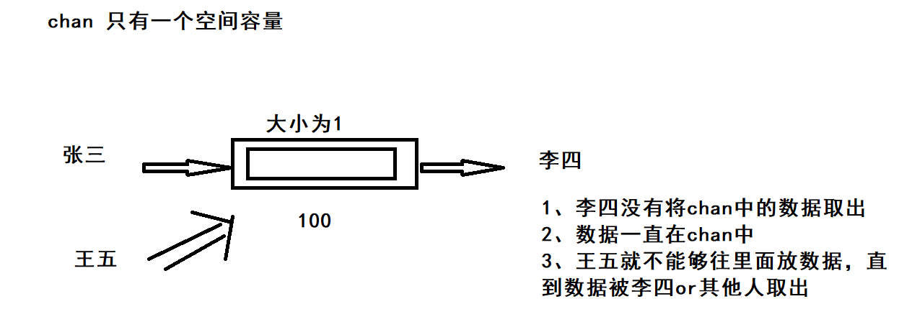
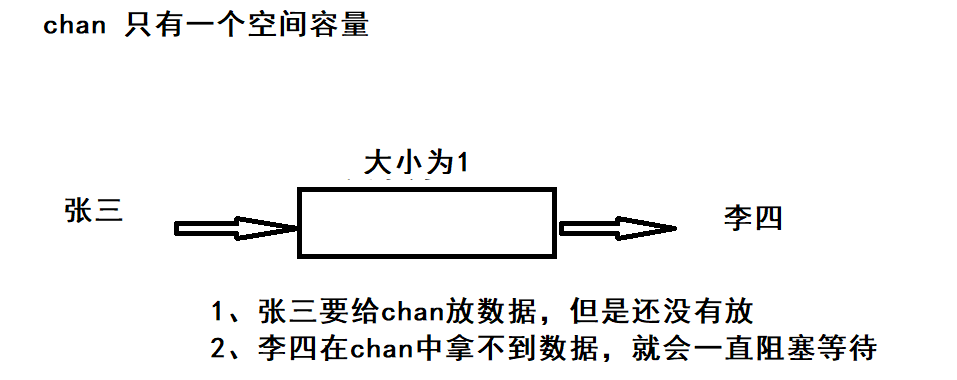
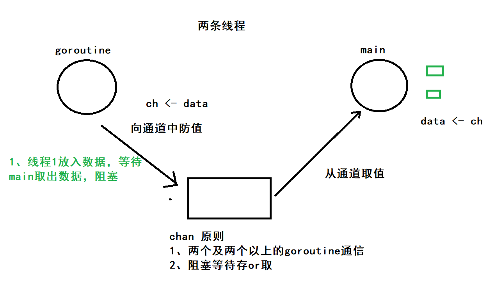

# Channel

## Channel的概念及简单使用

1、Go语言不建议我们使用锁机制来解决多线程问题，而是建议我们使用通道。

2、通信的角色必须在2个以上，一个人就不叫作通信了

3、所以说chan必须要作用在两个及两个以上的goroutine

4、一个goroutine需要将一些信息告诉另外一个goroutine，就直接将数据信息放入chan即可

通道：可以被认为是goroutine的通信管道

类似于水管，可以从一端流到另一端

**不要通过共享内存来通信，而应该通过通信来共享内存（channel）**

```go
// chan 类型，通道
var a chan int
a = make(chan int)

// 使用规则(存chan<-、取<-chan)
a <- 1
data := <- a
```

对channel的简单认识

```go
package main

import "fmt"

// 定义通道 chan
func main() {
    // 定义一个bool的通道
    var ch chan bool
    ch = make(chan bool)

    // 在一个goroutine中去往通道中放入数据
    go func() {
       for i := 0; i < 10; i++ {
          fmt.Println("groutine-", i)
       }
       ch <- true
    }()

    // 另一个goroutine可以从通道中取出数据，这就是线程之间的通信
    // 会阻塞等待ch拿到值，有另外一个goroutine往里面放值
    data := <-ch
    fmt.Println("ch data:", data)
}
```

**一个通道发送和接收数据，默认是阻塞的。**

**当一个数据被发送到通道时，在发送语句中被阻塞，直到另一个Goroutine从该通道读取数据。**



**相对地，当从通道读取数据时，读取被阻塞，直到一个Goroutine将数据写入该通道。**



**本身channel就是同步的， 意味着同一时间，只能有一条goroutine来操作。**

最后:通道是goroutine之间的连接，**所有通道的发送和接收必须处在不同的goroutine中**。

这些通道的特性是帮助Goroutines有效地进行通信，而**无需像使用其他编程语言中非常常见的显式锁或条件变量**。

## 死锁问题

```go
package main

import (
    "fmt"
)

// 定义通道 chan
// 这个 goroutine 希望告诉 main 线程，我还没结束。（通信）
func main() {
    // 定一个bool的通道
    var ch chan bool
    ch = make(chan bool)

    //// 在一个goroutine中去往通道中放入数据
    go func() {
       for i := 0; i < 10; i++ {
          fmt.Println("goroutine-", i)
       }
       //time.Sleep(time.Second * 3)
       ch <- true
    }()

    // 定义好通道之后，如果没有 goroutine来使用（必须在两个及以上goroutine），那么就会产生死锁
    // deadlock!
    data := <-ch
    fmt.Println("ch data:", data)

    // 死锁的产生，没有goroutine来消耗通道（存取）
    ch2 := make(chan int)
    ch2 <- 10
}
```

死锁的其他情况：https://blog.csdn.net/liu19721018/article/details/112778834

1、单线程的使用，没有其他的goroutine消费

2、两个chan，互相需要对方的数据，但是由于判断，拿不到对方的数据。

3、sync 锁产生的死锁。

## 关闭通道

```go
package main

import (
    "fmt"
    "time"
)

// 关闭通道
// 告诉接收方，我不会再有其他数据发送到chan中了。
func main() {
    // 在main线程中定义的通道
    ch1 := make(chan int)
    go test7(ch1)
    // 读取chan中的数据
    for true {
       time.Sleep(time.Second)
       // ok 判断chan的状态是否是关闭的，如果是关闭的，就不会再取值了
       // ok 如果是true，就代表我们还在读取数据，如果是false，那么就代表通道关闭
       data, ok := <-ch1
       if !ok {
          fmt.Println("channel closed")
          break
       }
       fmt.Println("ch1's data:", data)
    }
}

func test7(ch chan int) {
    for i := 0; i < 10; i++ {
       ch <- i
    }
    // 放完了之后就手动关闭通道
    // 相当于告诉接收方，不会再往ch中放入数据
    close(ch)
}
```



通过ok来判断是否读取完毕数据。

### for range 简化开发

```go
package main

import "fmt"

// 关闭通道
// 告诉接收方，我不会再有其他数据发送到chan中了。
func main() {
    // 在main线程中定义的通道
    ch1 := make(chan int)
    go test7(ch1)
    // 读取chan中的数据, for 一个个取，并且会自动判断chan是否close 迭代器
    for i := range ch1 {
       fmt.Println("ch1's data:", i)
    }
}

func test7(ch chan int) {
    for i := 0; i < 10; i++ {
       ch <- i
    }
    // 放完了之后就手动关闭通道
    // 相当于告诉接收方，不会再往ch中放入数据
    close(ch)
}
```

## 缓冲通道（chan）

> 非缓冲通道

chan只能存放一个数据，发送和接收都是阻塞的，一次发送对应一个接收

> 缓冲通道

通道带了一个缓冲区，发送的数据直到缓冲区填满为止，才会被阻塞，接收的也是，只有缓冲区清空，才会阻塞

```go
package main

import "fmt"

// 缓冲通道
func main() {

    // 新建缓冲通道，容量为5
    // 缓冲区通道，放入数据，不会产生死锁，它不需要等待另外的线程来取数据，它可以放多个数据
    // 但是如果缓冲通道满了，还是没有人来取数据，那么就会产生死锁

    ch2 := make(chan int, 5)
    fmt.Println(cap(ch2), len(ch2)) // 5 0
    // 也就只有缓冲通道可以在一个线程中自己使用自己
    ch2 <- 3
    data := <-ch2
    fmt.Println(data)
    
    go test8(ch2)
    for v := range ch2 {
       fmt.Println(v)
       fmt.Println(cap(ch2), len(ch2)) // 可以通过len来判断缓冲通道中的数据数量
    }

}

func test8(ch chan int) {
    for i := 0; i < 10; i++ {
       ch <- i
    }
    close(ch)
    fmt.Println("done")
}
```

- 缓冲通道，可以定义缓冲区的容量
- 如果缓冲区没有满，那么就可以继续存放，如果满了，那么就会阻塞等待
- 如果缓冲区是空的，读取也会阻塞等待
- 如果缓冲区中有多个数据，依次按照先进先出的规则进行读取
- 如果缓冲区满了，同时有两个进程在读或者写，这个时候和普通的chan一样，一进一出

## 定向通道

分为**双向通道**和**单向通道**

```go
package main

import "fmt"

// 定向通道
func main() {
    // 双向通道
    ch1 := make(chan int)
    ch1 <- 100
    data := <-ch1
    fmt.Println(data)

    // 单向通道：只允许写数据，不能读
    ch2 := make(chan<- int, 1)
    ch2 <- 200
    //cannot receive from send-only channel ch2
    //data = <-ch2
    // 只允许读数据，不允许写数据
    ch3 := make(<-chan int, 1)
    //cannot send to receive-only channel ch3
    //ch3 <- 100
}
```

### 使用场景

```go
package main

import (
    "fmt"
    "time"
)

// 单向通道的使用场景
func main() {

    // 可读可写：双向通道
    ch1 := make(chan int)
    go writeOnly(ch1)
    go readOnly(ch1)
    time.Sleep(time.Second)
}

// 作为函数的参数或者返回值之类的
// 指定函数去写，不让他读取，防止通道滥用
func writeOnly(ch chan<- int) {
    // 函数的内部处理一些写数据的操作
    ch <- 100
}

// 指定函数去读，不让他写入，防止通道滥用
func readOnly(ch <-chan int) {
    // 函数内部处理一些读取数据的操作
    data := <-ch
    fmt.Println(data)
}
```

## Select

```go
package main

import (
    "fmt"
    "time"
)

func main() {

    ch1 := make(chan int)
    ch2 := make(chan int)

    go func() {
       time.Sleep(2 * time.Second)
       ch1 <- 100
    }()

    go func() {
       time.Sleep(2 * time.Second)
       ch2 <- 200
    }()
    // 读取chan数据，无论谁先放入，我们就用谁，抛弃其他的
    // select 和 switch 只是在通道中使用，case 表达式需要是一个通道结果
    select {
    case num1 := <-ch1:
       fmt.Println(num1)
    case num2 := <-ch2:
       fmt.Println(num2)
       //default:
       // fmt.Println("default case")
    }
}
```

1、每一个case必须是一个通道的操作<-

2、所有chan操作都要有结果（通道表达式都必须会被求值）（num1 := <-ch1）

3、如果任意的通道拿到了结果，他就会立即执行该case，其他的就会被忽略

4、如果有多个case都可以运行，select是随机选取一个执行，其他的就不会执行

5、如果存在default，执行该语句，如果不存在，那么就阻塞等待select直到某个通道可以运行

## Timer 定时器

可以控制程序在某个时间做某个事情

```go
package main

import (
    "fmt"
    "time"
)

// 定时器：（time：当下，xxx之前before，xxx之后after）
func main() {
    // 创建一个定时器 NewTimer
    /*
       type Timer struct {
          C <-chan Time
          r runtimeTimer
       }
    */
    //timer := time.NewTimer(3 * time.Second)
    //// 打印当前时间
    //fmt.Println(time.Now())
    //// timer.C是一个时间通道，这个通道中存放的值就是我们在定义定时器的时候，存放的时间，然后等待对应的时间
    //timeChan := timer.C
    //fmt.Println(<-timeChan)

    // 提前关闭定时器
    timer2 := time.NewTimer(5 * time.Second)
    go func() {
       // 取出来立即关闭定时器
       <-timer2.C
       fmt.Println("end")
    }()
    // 手动关闭定时器
    timer2.Stop()
}
```

1、定时发邮件

2、定时保存数据库文件  sql

### After  Before

```go
package main

import (
    "fmt"
    "time"
)

func main() {
    // chan 放入档期那时间之后的某个时间
    timerChan := time.After(time.Second * 3)
    fmt.Println(time.Now())
    chanTime := <-timerChan
    fmt.Println(chanTime)

    // 3s之后执行这个函数
    timer := time.AfterFunc(time.Second*3, mail)
    tmChan := timer.C
    fmt.Println(<-tmChan)
    
    time.Sleep(4 * time.Second)
}

func mail() {
    // 发邮件
    fmt.Println("mail")
}
```