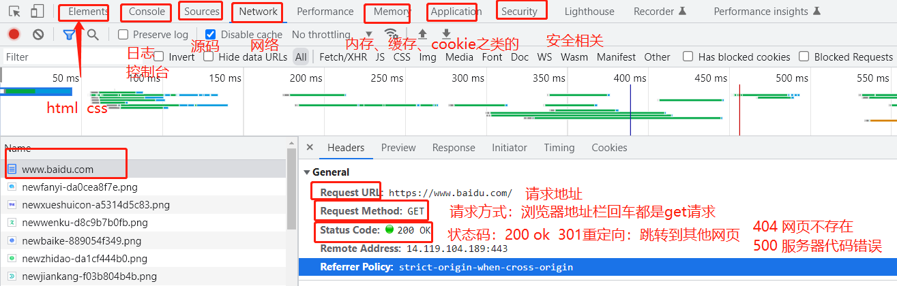

# HTTP编程

## web的基础知识

1、静态web（网页：所有人看都一样的）、动态web（千人前面，所有人数据都不一样）

2、web应用：可以给浏览器来访问的程序。（B/S 浏览器和服务器)   （C/S 客户端服务器：跨平台：windows mac linux）

3、HTTP协议：超文本（图片、视频、定位...地图...）传输协议 ，80 。  https协议：443端口，更安全的。

4、所有的网页：**请求（request）- 响应（response）**

- 请求：url地址   https://www.baidu.com  14.119.104.189  （客户端：浏览器）
- 响应：一些数据或者一个网页。（服务端：后台：接收用户的请求，然后处理这些请求，最终返回数据）
  - 80% 查询 、增删改 （CRUD）
  - 优化这些代码的效率，增加代码的健壮性

5、请求方式：Get

- 浏览器的开发者模式 F12、右键：检查
- 
- 请求方式除了Get以外 ，Post ，还有很多其他的 put delete .....
- 

6、web程序工作原理

- 客户端 - 连接到服务器  TCP/IP 协议
- 客户端向服务端发送HTTP(s)请求，请求中会包含一些数据或者文件
  - www.xxx.com/login? username = xxx & pwd = xxxx
  - upload/video?file=xxxxx
- 服务器收到了这个请求，分析这里面的数据或者文件，返回用户需要的结果（CRUD）。
- 客户端收到服务器响应，展示给客户（网页、小程序。。。。）
- 客户端和服务器断开连接。

## helloworld

go语言中所有和网络相关的都在 net 包下，http也在net包下。

包含了客户端和服务端的代码实现。

**请求（request）- 响应（response）**

### 服务端

```go
package main

import (
    "fmt"
    "net/http"
)

// 一个简单的服务端代码实现
// http程序启动之后是不会停止的，一直监听请求
func main() {
    // 写一些请求来接收浏览器的信息
    // HandleFunc http请求的处理函数
    // 源码：func HandleFunc(pattern string, handler func(ResponseWriter, *Request))
    // localhost:8080/hello url -> 代码处理
    http.HandleFunc("/hello", hello)

    // func ListenAndServe(addr string, handler Handler)
    // localhost 本机（127.0.0.1）  ： 端口 （8080）
    // nil默认处理器，空的 404
    // 开启监听程序的代码是放在main方法的最后一行的。
    http.ListenAndServe("localhost:8080", nil)
}

// 请求和响应
func hello(resp http.ResponseWriter, req *http.Request) {
    // 查看一些请求信息 (/login:用户名和密码来匹配登录  /user/id 接收用户的id然后查询用户信息 )
    fmt.Println(req.URL)
    fmt.Println(req.Method)
    fmt.Println(req.RemoteAddr)

    // 一般会响应一些信息给客户端 （文字、网页） resp.Write
    // 响应一段文字[]byte("hello,web")
    // 响应一段html代码 []byte("html代码") 网页
    resp.Write([]byte("<h1 style=\"color: red;\">hello,web</h1>"))

}
```

### 客户端

```go
package main

import (
	"fmt"
	"io"
	"net/http"
)

func main() {
	// 使用GET请求本地的hello
	resp, connectErr := http.Get("http://127.0.0.1:8080/hello")
	if connectErr != nil {
		panic(connectErr)
	}
	// defer 关闭连接
	// resp.Body 是响应的主体
	defer resp.Body.Close()
	fmt.Println("response Status:", resp.Status)
	fmt.Println("response Headers:", resp.Header)

	// 接收具体的响应内容
	buf := make([]byte, 10)
	for true {
		n, readErr := resp.Body.Read(buf)
		if readErr == io.EOF {
			res := string(buf[:n])
			fmt.Println("response Body:", res)
			fmt.Println("读取完毕")
			break
		} else if readErr != nil {
			fmt.Println("读取出现错误")
		}
		res := string(buf[:n])
		fmt.Println("response Body:", res)
	}
}
```

## 带参数的请求

### 服务端

```go
package main

import (
    "fmt"
    "net/http"
)

// 一个简单的服务端代码实现
// http程序启动之后是不会停止的，一直监听请求
func main() {
    // 写一些请求来接收浏览器的信息
    // HandleFunc http请求的处理函数
    // 源码：func HandleFunc(pattern string, handler func(ResponseWriter, *Request))
    // localhost:8080/hello url -> 代码处理
    http.HandleFunc("/hello", hello)
    http.HandleFunc("/login", login)

    // func ListenAndServe(addr string, handler Handler)
    // localhost 本机（127.0.0.1）  ： 端口 （8080）
    // nil默认处理器，空的 404
    // 开启监听程序的代码是放在main方法的最后一行的。
    http.ListenAndServe("localhost:8080", nil)
}

// 请求和响应
func hello(resp http.ResponseWriter, req *http.Request) {
    // 查看一些请求信息 (/login:用户名和密码来匹配登录  /user/id 接收用户的id然后查询用户信息 )
    fmt.Println(req.URL)
    fmt.Println(req.Method)
    fmt.Println(req.RemoteAddr)

    // 一般会响应一些信息给客户端 （文字、网页） resp.Write
    // 响应一段文字[]byte("hello,web")
    // 响应一段html代码 []byte("html代码") 网页
    resp.Write([]byte("<h1 style=\"color: red;\">hello,web</h1>"))

}

func login(resp http.ResponseWriter, req *http.Request) {
    fmt.Println("接收到了login请求")
    // 拿到请求中的参数
    urlData := req.URL.Query()
    username := urlData.Get("username")
    password := urlData.Get("password")
    if username == "admin" || password == "123456" {
       resp.Write([]byte("<h1>欢迎您，admin，登录成功了</h1>"))
    } else {
       resp.Write([]byte("<h1>用户名或者密码错误</h1>"))
    }
}
```

### 客户端

```go
package main

import (
    "fmt"
    "io"
    "net/http"
    "net/url"
)

func main() {
    // 复杂请求
    urlStr := "http://127.0.0.1:8080/login"
    // 参数如何拼接到url上，参数封装为数据
    data := url.Values{}
    // 设置数据
    data.Set("username", "admin")
    data.Set("password", "123456")

    // 将urlStr解析为一个真正的URL对象
    newURL, _ := url.ParseRequestURI(urlStr)
    // 在URL对象中添加数据
    newURL.RawQuery = data.Encode()

    fmt.Println(newURL.String())
    // http://127.0.0.1:8080/login?password=123456&username=admin

    // 向服务端发起请求
    resp, _ := http.Get(newURL.String())
    defer resp.Body.Close()
    // io.ReadAll 直接读取全部的Body信息
    body, _ := io.ReadAll(resp.Body)
    fmt.Println(string(body))
}
```

## 表单参数获取

### html表单

```html
<!DOCTYPE html>
<html lang="en">
<head>
    <meta charset="UTF-8">
    <title>Register</title>
</head>
<body>
<form action="http://127.0.0.1:8080/register" method="POST">
    <h2>注册</h2>
    <p>用户名:
        <input type="text" name="username">
    </p>
    <p>密码:
        <input type="password" name="password">
    </p>
    <input type="submit" value="注册">
</form>
</body>
</html>
```

### 服务端

```go
package main

import (
    "fmt"
    "net/http"
)

// 一个简单的服务端代码实现
// http程序启动之后是不会停止的，一直监听请求
func main() {
    // 写一些请求来接收浏览器的信息
    // HandleFunc http请求的处理函数
    // 源码：func HandleFunc(pattern string, handler func(ResponseWriter, *Request))
    // localhost:8080/hello url -> 代码处理
    http.HandleFunc("/hello", hello)
    http.HandleFunc("/login", login)
    http.HandleFunc("/register", register)

    // func ListenAndServe(addr string, handler Handler)
    // localhost 本机（127.0.0.1）  ： 端口 （8080）
    // nil默认处理器，空的 404
    // 开启监听程序的代码是放在main方法的最后一行的。
    http.ListenAndServe("localhost:8080", nil)
}

// 请求和响应
func hello(resp http.ResponseWriter, req *http.Request) {
    // 查看一些请求信息 (/login:用户名和密码来匹配登录  /user/id 接收用户的id然后查询用户信息 )
    fmt.Println(req.URL)
    fmt.Println(req.Method)
    fmt.Println(req.RemoteAddr)

    // 一般会响应一些信息给客户端 （文字、网页） resp.Write
    // 响应一段文字[]byte("hello,web")
    // 响应一段html代码 []byte("html代码") 网页
    resp.Write([]byte("<h1 style=\"color: red;\">hello,web</h1>"))

}

func login(resp http.ResponseWriter, req *http.Request) {
    fmt.Println("接收到了login请求")
    // 拿到请求中的参数
    urlData := req.URL.Query()
    username := urlData.Get("username")
    password := urlData.Get("password")
    if username == "admin" || password == "123456" {
       resp.Write([]byte("<h1>欢迎您，admin，登录成功了</h1>"))
    } else {
       resp.Write([]byte("<h1>用户名或者密码错误</h1>"))
    }
}

func register(resp http.ResponseWriter, req *http.Request) {
    fmt.Println("接收到了register请求")
    // 处理表单的请求
    // 解析表单
    req.ParseForm()
    // 获取POST表单参数
    username := req.Form.Get("username")
    password := req.Form.Get("password")
    if username != "" && password != "" {
       resp.Write([]byte("<h1>" + "欢迎, " + username + "注册成功" + "</h1>"))
    }
}
```

## 要给前端响应数据

- 我们给前端数据
- 页面模板要渲染数据！有很多语法。类似于Java中的JSP 、或者PHP里面的代码
- 前后端分离（我们后面都用这种方式）

通过代码跳转到页面 template

### 服务端

```go
package main

import (
    "fmt"
    "html/template"
    "net/http"
)

type User struct {
    Name string
    Age  int
}

// 一个简单的服务端代码实现
// http程序启动之后是不会停止的，一直监听请求
func main() {
    // 写一些请求来接收浏览器的信息
    // HandleFunc http请求的处理函数
    // 源码：func HandleFunc(pattern string, handler func(ResponseWriter, *Request))
    // localhost:8080/hello url -> 代码处理
    http.HandleFunc("/hello", hello)
    http.HandleFunc("/login", login)
    http.HandleFunc("/register", register)
    http.HandleFunc("/findAll", findAll)

    // func ListenAndServe(addr string, handler Handler)
    // localhost 本机（127.0.0.1）  ： 端口 （8080）
    // nil默认处理器，空的 404
    // 开启监听程序的代码是放在main方法的最后一行的。
    http.ListenAndServe("localhost:8080", nil)
}

// 请求和响应
func hello(resp http.ResponseWriter, req *http.Request) {
    // 查看一些请求信息 (/login:用户名和密码来匹配登录  /user/id 接收用户的id然后查询用户信息 )
    fmt.Println(req.URL)
    fmt.Println(req.Method)
    fmt.Println(req.RemoteAddr)

    // 一般会响应一些信息给客户端 （文字、网页） resp.Write
    // 响应一段文字[]byte("hello,web")
    // 响应一段html代码 []byte("html代码") 网页
    resp.Write([]byte("<h1 style=\"color: red;\">hello,web</h1>"))

}

func login(resp http.ResponseWriter, req *http.Request) {
    fmt.Println("接收到了login请求")
    // 拿到请求中的参数
    urlData := req.URL.Query()
    username := urlData.Get("username")
    password := urlData.Get("password")
    if username == "admin" || password == "123456" {
       resp.Write([]byte("<h1>欢迎您，admin，登录成功了</h1>"))
    } else {
       resp.Write([]byte("<h1>用户名或者密码错误</h1>"))
    }
}

func register(resp http.ResponseWriter, req *http.Request) {
    fmt.Println("接收到了register请求")
    // 处理表单的请求
    // 解析表单
    req.ParseForm()
    // 获取POST表单参数
    username := req.Form.Get("username")
    password := req.Form.Get("password")
    if username != "" && password != "" {
       resp.Write([]byte("<h1>" + "欢迎, " + username + "注册成功" + "</h1>"))
    }
}

func findAll(resp http.ResponseWriter, req *http.Request) {
    // 接收到前端的信息 /findAll， 查询全部用户
    userMap := make(map[int]User)
    userMap[1] = User{"KUANGSHEN", 1}
    userMap[2] = User{"xiaoming", 2}

    // 返回给前端页面并渲染上去
    temp, _ := template.ParseFiles("./userlist.html")
    data := make(map[string](map[int]User))
    data["data"] = userMap
    temp.Execute(resp, data)
}
```

### 渲染页面

```go
<!DOCTYPE html>
<html lang="en">
<head>
    <meta charset="UTF-8">
    <title>查询用户</title>
</head>
<body>
<!--获取后端的数据 {{.data}}
遍历
{{range $k,$v := .data}}

{{end}}

-->

{{range $k,$v := .data}}
{{$k}}
{{.Name}}
{{$v}}
{{end}}

</body>
</html>
```