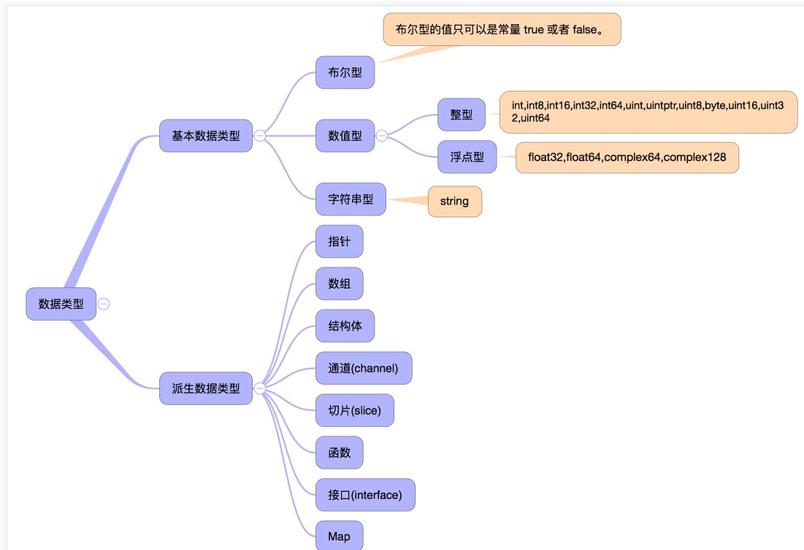
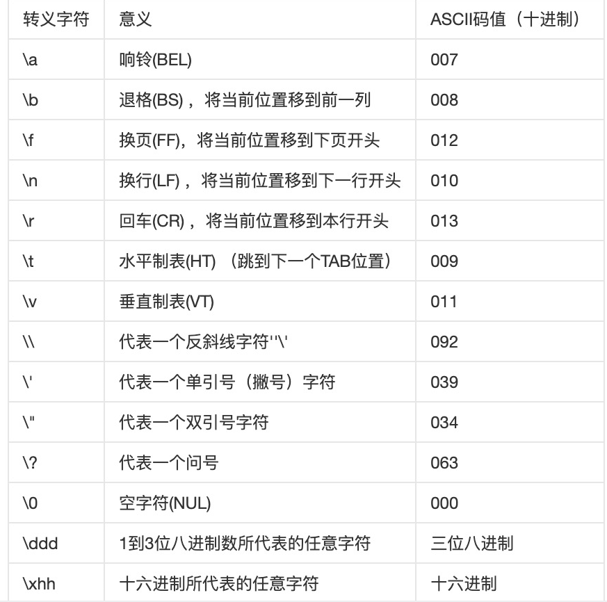
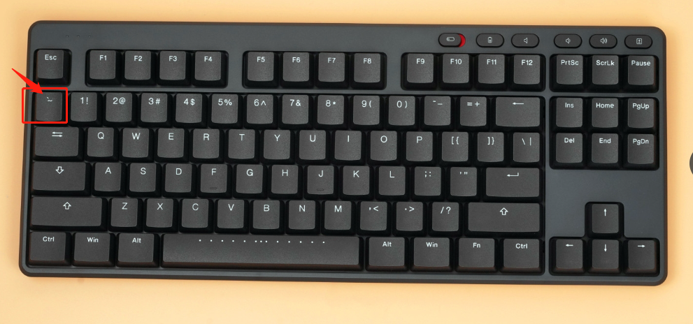

# Go语言基础语法

## 注释

注释主要是针对一些自己不太理解的业务或者是复杂的业务

在开源项目中，注释十分的完善

```go
//当行注释
/*
多行注释
*/
```

写注释是一个良好的习惯，我们都应该按照要求给自己的代码写好注释

## 变量

### 常规变量声明

通过 var 关键字来定义变量

格式：var 变量名字 变量类型 = 值

```go
var name string = "张三"
```

```go
package main

import "fmt"

func main() {
	// 定义变量没有赋值的话就会给他们赋一个默认值
	// string 默认值是""，int 默认值为 0
	var name string
	var age int

	// 同时定义多个变量，只需要使用 var()
	var (
		address string
		phone   string
	)

	fmt.Println(name)
	fmt.Println(age)
	fmt.Println(address)
	fmt.Println(phone)

	// 变量赋值，变量是可以被重复复制的(定义之后才进行赋值)
	name = "张三"
	fmt.Println(name)

	// 定义变量就进行赋值
	var dog string = "旺财"
	fmt.Println(dog)

}
```

### 短变量的声明方式

它是一种语法糖，方便简化开发

```go
package main

import "fmt"

func main() {
    // 问题1：能不能不屑数据类型来定义变量
    // 问题2：不用 var 能不能直接定义变量？
    /* 问题3：只定义变量，不使用可以吗？
    == 实际上是不可以的，因为没有使用到的变量就是垃圾变量，没有意义，会出现报错
    */

    // 自动推导。一个短变量声明
    name := "张三"
    // := 相当于快速定义变量，如果给这个变量赋值了，那么会自动推导它的类型
    // var、基本数据类型的定义都被省略了
    fmt.Println(name)
}
```

> 小结

1. 定义变量使用定式：var 变量名 变量数据类型
2. 给变量赋值，可以定义的时候直接赋值 或者是定义完之后再通过变量名赋值
3. 语法糖：":="。可以通过它来快速定义变量，若为基本数据类型，它会自动推导类型

### 变量交换

```go
package main

import "fmt"

func main() {
	/*
		在编程中遇到的第一个问题：变量交换
		var a int = 100
		var b int = 200

		引入第三方进行交换
		var t int
		t = a
		a = b
		b = t
	*/
	//	在 Go 语言中，程序变量交换也有语法糖
	var a int = 100
	var b int = 200
	fmt.Println("交换前：")
	fmt.Println(a)
	fmt.Println(b)
	// 底层本质还是用到了临时变量
	b, a = a, b
	fmt.Println("交换后：")
	fmt.Println(a)
	fmt.Println(b)
}

```

### 变量的内存地址

变量就相当于一个盒子，开辟了一个空间

当我们声明变量的时候，就会向计算机申请一块可以存放对应数据类型的空间，也就是内存地址

比如说

```go
var num int
```

那么我们就向计算机申请了一块可以存储int类型的内存地址，里面只能存放int类型的数据

变量 num 这个只是给开发者看的，计算机中变量的名字是类似0xc00000e0a8 这种类型的

```go
package main

import "fmt"

func main() {
	// 变量到底是什么玩意？

	var num int
	num = 100
	// 在计算机中 num 是什么样子的？
	fmt.Println("num:", num)
	num = 2000
	fmt.Println("num:", num)

	// 打印内存地址的方式之一。Printf 格式化输出
	// 输出 num 的值
	fmt.Printf("num的值:%d\n", num)
	// 输出变量的内存地址
	fmt.Printf("num的内存地址:%p\n", &num)
	num = 1000
	fmt.Println("num的值:", num)
	fmt.Printf("num的内存地址:%p\n", &num)
}

```

可以看到内存地址不变，变得只有里面的值

```go
num的值:2000
num的内存地址:0xc00000e0a8
num的值: 1000
num的内存地址:0xc00000e0a8
```

### 匿名变量

```go
package main

import "fmt"

// 没有名字的变量就被称为匿名变量
// 十分特殊，匿名变量类似于黑洞，任何赋值给匿名变量的值都会被丢弃
// _ 下划线，就是Go语言中的匿名变量
func main() {
	// 调用这个函数，应该会返回两个结果 100，200

	a, b := test()
	fmt.Println(a, b)
	// 如果我们只想要 test 函数返回的第一个结果的话就可以使用匿名函数
	c, _ := test()
	fmt.Println(c)
}

// 函数就是一段代码的集合
// 基本的操作函数，调用函数，返回两个数字
func test() (int, int) {
	// return 返回结果
	return 100, 200
}

```

### 局部变量和全局变量

```go
package main

import "fmt"

// 全局变量：在当前 go 文件中生效
// 定义在 go 文件非函数内，在 package 和 import 下面
// 全局变量的定义必须得使用 var 关键字，如果使用 := 语法糖则会出现报错
// 全局变量和局部变量是可以重名的，这就涉及到优先级的问题：到底用谁

var c int

func main() {
    // 局部变量：只在一定的范围内生效
    // 在函数体内声明变量
    var b int = 3
    var a = 4
    // 如果全局变量有，那么直接使用全局变量来接收
    c = a + b
    fmt.Printf("c:%d,a:%d,b:%d\n", c, a, b)
    fmt.Printf("c内存地址:%p\n", &c)
    b = 1
    // 如果全局和局部都有，那么使用局部变量优先（就近原则）
    c := a + b
    fmt.Printf("c:%d,a:%d,b:%d\n", c, a, b)
    fmt.Printf("c内存地址:%p\n", &c)
    b = 5
    c = a + b
    fmt.Printf("c:%d,a:%d,b:%d\n", c, a, b)
    fmt.Printf("c内存地址:%p\n", &c)
}
```

**就近原则**

```go
package main

import "fmt"

var a float64 = 3.14

func main() {
	var a float64 = 2.18
	fmt.Println(a)
}
//2.18
```

### 常量

常量：不能变化的量。这个变量是一个特殊的变量，无法改变的

关键字：const

区别：变量定义使用 var，常量定义使用 const

**是什么机制导致它无法改变？**

Go 语言底层的约定，实际上它是可以改变的，需要跳过常量名，直接找到内存地址，进行修改值。

```go
package main

// 常量
func main() {
	// 通常定义常量的时候，建议使用大写字母来定义，区分普通变量
	// 一旦定义之后是不会发生变化的
	// 定义格式：const 常量名 [type] = value

	// 显式定义
	const URL string = "http://www.1.com"
	// 隐式定义
	const URL2 string = "http://www.2.com"
	// 同时定义多个常量
	const URL3, URL4 = "http://www.3.com", "http://www.4.com"
}

```

#### 特殊的常量 iota

```go
package main

import "fmt"

// 特殊的常量 iota  -- 常量计数器
// 在有多个常量的情况下，会自动帮我们 +1

func main() {
	// iota 在一组 const 中，每次定义新的常量，那么它会自动 +1
	// iota 默认为 0
	const (
		a = iota
		b = iota
		c = iota
		d = 0
		e = iota
		// 如果在定义 const 的时候，如果下面的常量没有赋值
		// 默认沿用上面的常量定义赋值
		f
		g
		h = iota
		// .... 1000+
	)
	fmt.Println(a, b, c, d, e, f, g, h)
	// 0 1 2 0 4 5 6 7
	// 所以 iota 只计算常量的个数
}

```


## 总结

1. 注释，给自己看，也给别人看
2. 变量的定义：var 变量名 变量类型
3. 变量的赋值：变量 = 变量值
4. 变量定义的语法糖 **:=**，只能用在变量当中，可以自动推导基本数据类型
5. 变量的本质就是内存空间
6. 匿名变量_
7. 变量的作用域：全局变量和局部变量，同名-就近原则
8. 常量的定义和场景（const），无法修改的值才会设置为常量，方便使用，通常使用大写
8. iota是特殊的常量，会自动计算一组之内的常量个数

## 数据类型

动态类型编程语言

- 运行时判断

静态类型的编程语言 ： Go 、C 、

- 在开发的时候，就需要给一些定义的变量赋值空间大小。C 需要自己去开辟这个空间

数据类型 ： 每种在Go语言中出现的**基本数据类型**，会有一个默认的空间大小。




### 布尔数据类型

布尔型的值只可以是常量 true 或者 false。一个简单的例子：var b bool = true。

```go
package main

import "fmt"

func main() {
	// bool 类型 只有两个值 true 和 false
	// 定义变量 bool 布尔类型的定义与 int、string 都是 Go 语言中的基本数据类型
	var b1 bool
	var b2 bool

	b1 = true
	b2 = false
	// Printf 格式化输出 %T 输出类型 %t 输出 bool 值
	fmt.Printf("b1=%T, %t\n", b1, b1)
	fmt.Printf("b2=%T, %t\n", b2, b2)
	// b1=bool, true
	// b2=bool, false

	var b3 bool
	fmt.Println("bool类型默认值：", b3)
	// bool类型默认值： false
}

```

### 数字型 int

整型 int 和浮点型 float32、float64，Go 语言支持整型和浮点型数字，并且支持复数，其中位的运算采用补码。

> Go 也有基于架构的类型，例如：uint 无符号、int 有符号

每个数字，都是有**范围**的， 有的数字只能大于0

有的数字可以小于0

在计算机中，所有的东西最终都是存在内存当中的，所以我们不能无限的放置东西（数字）


| 序号 | 类型和描述                                                   |
| :--- | :----------------------------------------------------------- |
| 1    | **uint8** 无符号 8 位整型 (0 到 255)                         |
| 2    | **uint16** 无符号 16 位整型 (0 到 65535)                     |
| 3    | **uint32** 无符号 32 位整型 (0 到 4294967295)                |
| 4    | **uint64** 无符号 64 位整型 (0 到 18446744073709551615)      |
| 5    | **int8** 有符号 8 位整型 (-128 到 127)  0                    |
| 6    | **int16** 有符号 16 位整型 (-32768 到 32767)                 |
| 7    | **int32** 有符号 32 位整型 (-2147483648 到 2147483647)       |
| 8    | **int64** 有符号 64 位整型 (-9223372036854775808 到 9223372036854775807) |

有符号数和无符号数的区别

- 0为分界，正负推进.......空间大小   ，空间大小是根据位来判断的  int 8 16 32 64、二进制的位，这个数据类型值的上限
- 0 + 空间大小

### 浮点型

```go
package main

import "fmt"

// 浮点数 float，默认是 float64
func main() {
	// 默认的 float 都是保存六位小数
	var f1 float64
	f1 = 3.16
	var f2 float32
	f2 = 5
	fmt.Printf("f1=%T, f1=%f\n", f1, f1)
	fmt.Printf("f2=%T, f2=%f\n", f2, f2)
	// f1=float64, f1=3.160000
	// f2=float32, f2=5.000000
	// 输出保存一位小数 %.1f 且四舍五入
	fmt.Printf("f1=%T, f1=%.1f\n", f1, f1)
	// f1=float64, f1=3.2

	// 浮点数是不精确的，这是因为计算机底层导致的
	// 浮点数和复数没法做到精确计算
}

```

验证：浮点数是不精确的

```go
package main

import "fmt"

func main() {
	// 浮点数：符号位 + 指数位 + 尾数位（存储过程中，尾数位可能会丢失，从而造成精度损失）
	// float64 的空间 > float32
	var num1 float32 = -123.0000901
	var num2 float64 = -123.0000901
	fmt.Println(num1)
	fmt.Println(num2)
	// -123.00009
	// -123.0000901
	// 结论：使用 float 来计算，可能导致数据不精确
	// float64 的精度 > float32，Go 语言中，浮点数默认使用的是 float64
}

```

通常情况下，关于浮点数，默认使用float64

### 特殊的数据类型

```go
package main

import "fmt"

// byte
func main() {
	// uint8 的别名是 byte
	// byte = uint8 (0-255 之间的整数，我们通常使用 byte 来定义)
	var num1 byte = 255
	fmt.Println(num1)
	// 255
	fmt.Printf("%T\n", num1)
	// uint8

	// 不经常使用的 rune = int32
	var num2 rune = 1000000000
	fmt.Println(num2)
	// 1000000000
	fmt.Printf("%T\n", num2)
	// int32

	// int、系统大小来的，32位  32、64默认是64
	// 软件跑在32位系统上是不兼容的
	var num3 int = 100000
	fmt.Println(num3)
	// 100000
	fmt.Printf("%T\n", num3)
	// int
}

```

### 字符串类型

字符串就是一串固定长度的字符连接起来的字符序列。  一段中文或者英文 （编码- 字符）

Go语言中，所有的字符串都是由单个 字符 连接起来的。兼容全世界文字的

> 拓展：了解编码表

UTF-8编码 ， 目前兼容我们绝大部分的文字和符号。

GBK编码：中国的编码表，号称兼容所有的中文汉字。

Unicode编码表 ：号称兼容了全世界的文字。

```go
package main

import "fmt"

func main() {
	var str string
	str = "Hello World"
	fmt.Printf("type(str)%T,str=%s\n", str, str)
	// type(str)string,str=Hello World

	// 单引号是字符(字符的本质是整形 int32 )
	// 双引号才是 string 类型
	v1 := 'A'
	v2 := "A"
	fmt.Printf("type(v1)%T,v1=%d\n", v1, v1)
	// type(v1)int32,v1=65
	fmt.Printf("type(v2)%T,v2=%s\n", v2, v2)
	// type(v2)string,v2=A
}

```

#### 转义字符

```go
package main

import "fmt"

func main() {
   // 特殊的字符 转义字符 \n
   // \n 换行
   fmt.Println("hello\nworld")
   // \b   backspace  删除上一个字符
   fmt.Println("hello\bworld")
   // \t  Tab
   fmt.Println("hello\tworld")
}
```




#### 多行输入使用 ``



```go
package main

import "fmt"

func main() {
	// ` ` 可以通过它来定义一些长字符串，可以换行输入
    fmt.Println(`\\n
            sadad
            asd
            a
            sd
            asda
            sd
            asda`)
}
```

### 数据类型的转换

在必要以及可行的情况下，**一个类型的值可以被转换成另一种类型的值**。

**由于Go语言不存在隐式类型转换，因此所有的类型转换都必须显式的声明： A = A(B)**

```go
package main

import "fmt"

// 类型转化
func main() {
	a := 5.6 // float
	// Go 语言中数据类型转换格式：新类型的值 = 新类型(旧类型的值)
	b := int(a) // b 就是 int 类型的 a = 5
	fmt.Printf("%T, %f\n", a, a)
	// float64, 5.600000
	fmt.Printf("%T, %d\n", b, b)
	// int, 5
	// 浮点数转化为整数，只保留整数部分

	// 布尔类型不支持类型转换
	// var flag bool = true
	// f := int(flag) -- 出现报错
}

```

变量的定义： var  变量名  **数据类型**

数据类型 是没有上限的，以上的都是基本数据类型，常用的，系统自带的，必要的。任何一个编程语言都会有。

除了这些之外，会存在一些自己开发的数据类型（数据结构都是可以自己定义的）

比如说：树，栈.......

## 运算符

### 算术运算符

```go
package main

func main() {
	// 算术运算符 + - * / % ++ --
	var a int = 7
	var b int = 3
	var c int // 结果

	c = a + b
	println(c)
	c = a - b
	println(c)
	c = a / b
	println(c)
	c = a % b // 取模
	println(c)
	c = a * b
	println(c)
	// 单元运算符，用自己就可以操作得出结果
	a++
	println(a)
	b--
	println(b)
}

```


### 关系运算符

大于 >

小于 <

等于 ==

不等于 !=

大于等于 >=

小于等于 <=

返回结果为：布尔值

```go
package main

import "fmt"

func main() {

	var a int = 100
	var b int = 200

	fmt.Println(a > b)
	fmt.Println(a >= b)
	fmt.Println(a <= b)
	fmt.Println(a < b)
	fmt.Println(a == b)
	fmt.Println(a != b)

}

```


### 逻辑运算符

判断多个条件是否存在的时候，就需要逻辑

> **&&** 与 只要有一个错，大家都是错的 false，两个都对才是对的。 多条件同时满足（与）

与（和）== And

对 And 对（true）

错 And 对  错和错  对 And 错 （false）

> **||** 或 只要有一个对的，那么就是对的，两个都是错的，结果才是错的。（or）

或 == Or 

对 or 错 （true）   对 or对（true）    错 or对 （true）

错or错   （错）

> **！**如果是真的，那么为假，如果是假，则为真。

非（取反）  

```go
package main

import "fmt"

func main() {
	var a bool = true
	var b bool = false

	// 与 都为真结果才为真，如果有假则结果为假 -- 短路判断
	fmt.Println(a && b)
	fmt.Println(a && a)
	fmt.Println(b && a)
	fmt.Println(b && b)
	// 或 如果有真则结果为真，都为假结果才为假
	fmt.Println(a || b)
	fmt.Println(b || a)
	fmt.Println(a || a)
	fmt.Println(b || b)
	fmt.Println(!a)
	fmt.Println(!b)

}

```

### 总结

1. 数据类型：bool、int、float、string
2. 数据类型的显示转换：B = B(A)
3. 运算符
   1. 算术
   2. 关系
   3. 逻辑

### 位运算符

（数的二进制来进行计算，常用于加密解密和一些特殊的高效运算）

Go 语言支持的位运算符如下表所示。假定 A 为60，B 为13：

| 运算符 | 描述                                                         | 实例                                   |
| :----- | :----------------------------------------------------------- | :------------------------------------- |
| &      | 按位与运算符"&"是双目运算符。都是1结果为1，否则是0           | (A & B) 结果为 12, 二进制为 0000 1100  |
| \|     | 按位或运算符"\|"是双目运算符。 都是0结果为0，否是是1         | (A \| B) 结果为 61, 二进制为 0011 1101 |
| ^      | 按位异或运算符"^"是双目运算符。 不同则为1，相同为0           | (A ^ B) 结果为 49, 二进制为 0011 0001  |
| &^     | 位清空，a &^ b，对于b上的每个数值，如果为0，则取a对应位上的数值，如果为1，则取0. | (A &^ B) 结果为 48, 二进制为 0011 0000 |
| <<     | 左移运算符"<<"是双目运算符。左移n位就是乘以2的n次方。 其功能把"<<"左边的运算数的各二进位全部左移若干位，由"<<"右边的数指定移动的位数，高位丢弃，低位补0。 | A << 2 结果为 240 ，二进制为 1111 0000 |
| >>     | 右移运算符">>"是双目运算符。右移n位就是除以2的n次方。 其功能是把">>"左边的运算数的各二进位全部右移若干位，">>"右边的数指定移动的位数。 | A >> 2 结果为 15 ，二进制为 0000 1111  |

```go
package main

import "fmt"

// 位运算符
// A 60 ---- 0011 1100
// B 13 ---- 0000 1101
func main() {
	// 0 false 1 true
	var a int = 60
	var b int = 13
	// & 与运算 两个都为真，结果为真
	// 0011 1100
	// 0000 1101
	// ---------
	// 0000 1100
	fmt.Println(a & b)
	// 12 = 0000 1100

	// | 如果都是假的，结果才为假
	// 0011 1100
	// 0000 1101
	// ---------
	// 0011 1101
	fmt.Println(a | b)
	// 61 = 0011 1101

	// ^ 按位异或 不同则为1，相同就为0
	// 0011 1100
	// 0000 1101
	// ---------
	// 0011 0001
	fmt.Println(a ^ b)
	// 49 = 0011 0001

	// &^ 位清空 对于 b 上的每个数值，如果为0，则取a对应位上的数值;如果为1，则取0
	// 0011 1100
	// 0000 1101
	// ---------
	// 0011 0000
	fmt.Println(a &^ b)
	// 48 = 0011 0000

	// 左移 << n、右移 >> n   n 为移动的位数
	// 移动完毕后，需要补位，左移补右边，右移补左边
	// 60 = 0011 1100
	// 60 -> 240
	fmt.Println(a << 2)
	// 240 = 1111 0000

	// 右移 >> n
	// 60 -> 15
	fmt.Println(a >> 2)
	// 15 = 0000 1111
}

```


### 赋值运算符

下表列出了所有Go语言的赋值运算符。

| 运算符 | 描述                                           | 实例                                  |
| :----- | :--------------------------------------------- | :------------------------------------ |
| =      | 简单的赋值运算符，将一个表达式的值赋给一个左值 | C = A + B 将 A + B 表达式结果赋值给 C |
| +=     | 相加后再赋值                                   | C += A 等于 C = C + A                 |
| -=     | 相减后再赋值                                   | C -= A 等于 C = C - A                 |
| *=     | 相乘后再赋值                                   | C *= A 等于 C = C * A                 |
| /=     | 相除后再赋值                                   | C /= A 等于 C = C / A                 |
| %=     | 求余后再赋值                                   | C %= A 等于 C = C % A                 |
| <<=    | 左移后赋值                                     | C <<= 2 等于 C = C << 2               |
| >>=    | 右移后赋值                                     | C >>= 2 等于 C = C >> 2               |
| &=     | 按位与后赋值                                   | C &= 2 等于 C = C & 2                 |
| ^=     | 按位异或后赋值                                 | C ^= 2 等于 C = C ^ 2                 |
| \|=    | 按位或后赋值                                   | C \|= 2 等于 C = C \| 2               |

```go
package main

import "fmt"

// 赋值运算符
func main() {
	// = 赋值
	var a int = 1
	var c int // 0
	c += a    // c = c + a
	fmt.Println(c)
	// 1
	c = 7
	c -= a // c = c - a
	fmt.Println(c)
	c *= a // c = c * a
	fmt.Println(c)
	c = 4
	a = 2
	c /= a // c = c / a
	fmt.Println(c)
}

```


### 其他运算符

下表列出了Go语言的其他运算符。

| 运算符 | 描述             | 实例                       |
| :----- | :--------------- | :------------------------- |
| &      | 返回变量存储地址 | &a; 将给出变量的实际地址。 |
| *      | 指针变量。       | *a; 是一个指针变量         |

