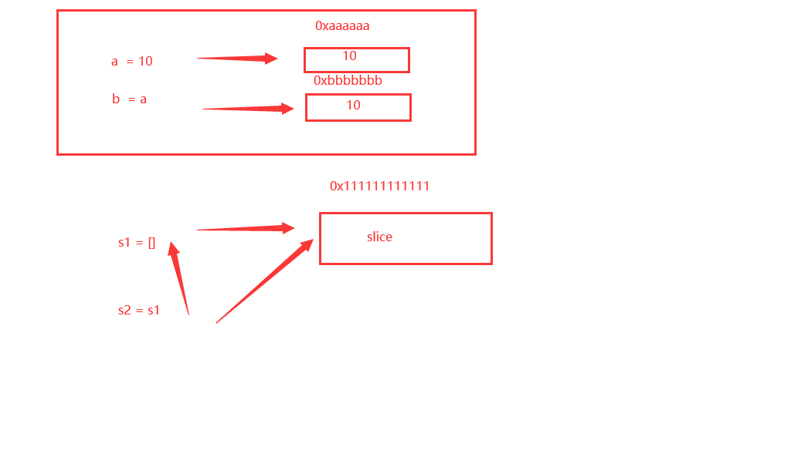

# Go函数

## 什么是函数

- 函数就是一段代码的集合
- Go语言中至少要有一个main函数
- 函数需要一个名字，独立定义的情况下。见名知意
- 函数可能需要有一个结果，也可能不需要

```go
package main

import "fmt"

func main() {
	// 调用函数：函数名 + () 调用
	add()
}

// func 定义函数
// 函数就是封装的思维，代码多了我们将一些功能代码提取出来，提高代码的复用性，让代码更加简洁清晰
/*
func 函数名(参数1, 参数2, ....) {
	函数的逻辑，本质就是一段代码
}
*/
func add() {
	fmt.Print("add")
}

```

**函数与方法是完全不一样的东西，只有面向对象里才有方法**

## 函数的具体定义

- 无参无返回值
- 有一个参数
- 有多个参数
- 有一个返回值
- 有多个返回值

**一个返回值**

```go
package main

import "fmt"

func main() {
	var num1 int = 10
	var num2 int = 20

	max_num := max(num1, num2)

	fmt.Println(max_num)
}

/*
函数的定式：
func 函数名(参数1, 参数2, ....) 返回值类型 {
	函数逻辑

	return xxx
}
*/

// 定义一个 max 函数，需要两个参数，int 类型

func max(num1 int, num2 int) int {
	if num1 > num2 {
		return num1
	}
	return num2
}

```

**多个返回值(和其他语言存在差异)**

交换值

```go
package main

import "fmt"

func main() {
	var a int = 100
	var b int = 200
	fmt.Println("交换前，a = ", a, " , b = ", b)
	a, b = swap(a, b)
	fmt.Println("交换后，a = ", a, " , b = ", b)
}

// 交换两个整数
// 有多个返回值的情况下，返回值类型用括号括起来
func swap(a int, b int) (int, int) {
	return b, a
}

```

计算周长面积

```go
package main

import "fmt"

func main() {

	zc, area := fun1(3, 4)
	fmt.Println(zc, area)
}

// 返回多个值需要括号，需要表名返回值类型，同时返回值也可以进行命名
func fun1(len float64, width float64) (zc float64, area float64) {
	// 周长
	zc = (len + width) * 2
	// 面积
	area = width * len
	// 只要返回参数名，会自动对应到上面的返回值上去，顺序无所谓(前提是返回值要命名)
	// return area, zc == return zc, area
	// 当在对返回值命名的情况下，那么可以直接return不加参数，
	return
}

```

## 可变参数

一个函数的参数类型确定，但是参数的个数不确定，可以使用可变参数

```go
package main

import "fmt"

func main() {
	fmt.Println("1")
	// Goland 使用 ctrl + 鼠标左键 进入方法
	fmt.Println("nsafjkahsbjkdb", 12312, 1237189) // 传递可变的参数个数---在Go语言中叫做空接口--any 任何的类型

	sum := getSum(1, 2, 3, 4, 5, 6, 7, 8, 9)
	fmt.Println(sum)
}

// 可变参数必须放在参数的最后面
func getSum(nums ...int) int {
	sum := 0
	// 接收了多个参数 nums
	// 使用下标来进行接收，下标从0开始
	// len函数可以获取可变参数的长度
	for i := 0; i < len(nums); i++ {
		sum += nums[i]
	}
	return sum
}

```

## 参数传递（留空）

- 引用传递（切片）
- 值传递（数组）

## 函数中的作用域

### 全局变量

全局变量定义在哪里都可以触发，但是我们默认定义在上面，方便文件统一管理和查看

```go
package main

import "fmt"

func main() {
	fmt.Println(num1)
}

var num1 int = 1000

```

### 局部变量

函数内部定义的变量只能在函数内部调用

```go
package main

import "fmt"

var NUM int = 1000

func main() {
	fmt.Println(NUM)

	// 定义一个只在 if 中生效的 if 临时变量;
	// 格式：if 临时变量;条件判断{作用域}
	// 对于很多一次性的变量都可以这么写
	// 优先考虑使用局部变量
	a := 1
	if temp := 1; a <= 10 {
		fmt.Println(temp)
	}
}

```

## 递归函数（小难点）

定义：一个函数自己调用自己，就叫做递归函数

注意：**递归函数需要有一个出口，逐渐向出口靠近，没有出口就会形成死循环**

```go
package main

import "fmt"

func main() {
	sum := getSum1(5)
	fmt.Println(sum)
}

// 求和 sum 1 + 2 + 3 + 4 + 5
// getSum(5)
//	getSum(4) + 5
//		getSum(3) + 4
//			。。。。。

func getSum1(num int) int {
	if num == 1 {
		return 1
	}
	return getSum1(num-1) + num
}

```

递归是一个压栈出栈的过程

## defer 延迟函数

defer函数或者方法：**一个函数或方法的执行被延迟了**

- 你可以在函数中添加多个defer语句，当函数执行到最后时，这些defer语句会按照逆序执行，最后该函数返回，特别是当你在进行一些打开资源的操作时，遇到错误需要提前返回，在返回前你需要关闭相应的资源，不然很容易造成资源泄露等问题
- 如果有很多个defer被调用，那么defer时采用先进后出的模式（栈）

### 单个defer

```go
package main

import "fmt"

// defer 作用：处理一些善后的问题，比如错误，文件，网络流关闭等操作
func main() {
	f("1")
	fmt.Println("2")
	defer f("3") // 等其他语句执行完毕之后，再来执行 defer 语句
	fmt.Println("4")
	// 1
	// 2
	// 4
	// 3
}

func f(s string) {
	fmt.Println(s)
}

```

### 多个defer

```go
package main

import "fmt"

// defer 作用：处理一些善后的问题，比如错误，文件，网络流关闭等操作
func main() {
	f("1")
	fmt.Println("2")
	defer f("3") // 等其他语句执行完毕之后，再来执行 defer 语句
	fmt.Println("4")
	defer f("5")
	fmt.Println("6")
	defer f("7")
	fmt.Println("8")
	// defer 倒序执行：7-5-3
}

func f(s string) {
	fmt.Println(s)
}

```

### defer传参的时机

```go
package main

import "fmt"

// defer 传参的调用时机
func main() {
	n := 10
	fmt.Println(n)
	defer ff(n)
	n++
	fmt.Println(n)
	// 输出为：10 11 10
	// 说明 defer 函数其实在n++之前就调用了，但是没有执行。参数已经传递进去了
}

func ff(n int) {
	fmt.Println(n)
}

```


## 函数的数据类型

```go
package main

import "fmt"

// 函数是什么（数据类型）
func main() {
	a := 10
	fmt.Printf("%T\n", a) // 查看变量的类型
	b := [4]int{1, 2, 3, 4}
	fmt.Printf("%T\n", b)
	// 函数的类型
	fun2()                   // 带了括号的是函数的调用
	fmt.Printf("%T\n", fun2) // 查看函数的类型 func()
	fmt.Printf("%T\n", fun3) // 查看函数的类型 func(int, int) (int, int)

	// 函数在Go语言中本身也是一个数据类型，加了()就是调用函数，不加()的话函数也是一个变量，可以赋值给别人
	// 函数的类型就等于该函数创建的类型，它也可以赋值给其他同类型的函数
	// var fun4 func(int, int) (int, int)
	fun4 := fun3
	c, d := fun4(1, 2)
	fmt.Println(c, d)
}

// 无参无返回值
func fun2() {

}

// 有参有返回值
func fun3(a, b int) (int, int) {
	return 0, 0
}

```

## 函数的本质

函数在Go语言中不是一个简单的调用或者接收结果的

函数在Go语言中是一个符合类型，可以看作是一个特殊的变量。var 定义，赋值，只需要类型相同即可

函数类型的定式：var f1 函数名(参数) 返回类型

我们知道变量名指向一段内存地址，那么函数名作为一个特殊的变量，它是指向一段函数体的内存地址，是一种特殊类型的变量

所以我们可以将一个函数赋值给另外一个类型相同的函数

## 匿名函数

```go
package main

import (
	"fmt"
)

// 匿名函数：没有名字的函数

func main() {
	// 正常的调用
	f12()
	f2 := f12
	f2()
	// f12 和 f2 本质上指向了同一个内存空间，空间中的代码一致{fmt.Println("我是f12函数")}

	// 匿名函数，在函数体后添加()，就相当于调用了这个函数，匿名函数只能调用一次
	func() {
		fmt.Println("我是一个匿名函数")
	}()

	// 将匿名函数进行赋值，就可以进行多次调用
	f3 := func() {
		fmt.Println("我是f3的匿名函数")
	}
	f3()

	// 匿名函数是否可以添加参数和返回值
	sum := func(a, b int) int {
		return a + b
	}(1, 2)
	fmt.Println(sum)
	
}

func f12() {
	fmt.Println("我是f12函数")
}

```

由于Go语言中的函数是一个特殊的变量，支持匿名操作

Go语言支持函数式编程

- 将匿名函数作为另外一个函数的参数，就被称之为回调函数
- 将匿名函数作为另外一个函数的返回值，就被称之为闭包结构

## 回调函数

高阶函数：可以将一个函数作为另外一个函数的参数

### 情景模拟

存在fun1和fun2两个函数

fun2接收fun1作为参数 = fun2(fun1)

fun2函数被称为高阶函数，接受了另一个函数作为参数

fun1函数被称为回调函数，作为另外一个函数（fun2）的参数

### 基本运算模拟

```go
package main

import "fmt"

// 回调函数
func main() {
	r1 := add1(1, 2)
	fmt.Println(r1)

	r2 := oper(1, 2, add1)
	fmt.Println(r2)

	r3 := oper(1, 2, sub)
	fmt.Println(r3)

	// 匿名函数
	mul := func(a, b float64) float64 {
		return a * b
	}
	r4 := oper(1, 2, mul)
	fmt.Println(r4)

	// 能够直接传递匿名函数
	r5 := oper(1, 2, func(a, b float64) float64 {
		if b == 0 {
			fmt.Println("除数不为0")
			return 0
		}

		return a / b
	})
	fmt.Println(r5)
}

// 定义高阶函数-运算(运算的数字，运算操作)，参数是接收另外一个函数
func oper(a, b float64, fun func(float64, float64) float64) float64 {
	r := fun(a, b)
	return r
}

// 普通的加法函数
func add1(a, b float64) float64 {
	return a + b
}

// 减法函数
func sub(a, b float64) float64 {
	return a - b
}

```

## 闭包

**一个外层函数中，有内层函数，该内层函数中，会操作外层函数的局部变量**

并且该外层函数的返回值就是这个内层函数。

这个内层函数和外层函数的局部变量，统称为闭包结构

局部变量的生命周期就会发生改变，正常的局部变量会随着函数的调用而创建，随着函数的结束而销毁，但是闭包结构中的外层函数的局部变量并不会随着外层函数的结束而销毁，因为内层函数还在继续使用

```go
package main

import "fmt"

// 闭包结构违反了程序正常的生命周期。是程序允许的一种特殊结构，它的变量作用域升级了，只要内层函数还在被调用，i就不会消失

// 什么时候用闭包：比如js会引用大量第三方库，js库中很多变量名是冲突的
// js 很多框架都是闭包结构的，防止变量冲突，全局变量污染
// 比如1.go中定义了i=1，2.go中定义了i=2，那么这两个变量就会发生冲突
// 当我们使用闭包结构的时候，1.go和2.go中的i就不会发生冲突了，解决一些变量作用域冲突的问题
func main() {
	r1 := increment()
	fmt.Println(r1) // 返回的是一个 increment 的内层函数，还没有执行
	// -- 执行这个内层函数，返回 i
	v1 := r1()
	fmt.Println(v1)
	v2 := r1()
	fmt.Println(v2)

	fmt.Println("---------------")

	// r2 和 r1 指向同一个地址
	r2 := increment() //再次调用的时候，i = 0
	v3 := r2()
	fmt.Println(v3) // 1

	fmt.Println(r1()) // 3  这里的 i 并没有随着第二次创建就被销毁归 0，而是在内层函数继续调用着
}

// 自增函数
// 函数的返回值为 func() int 类型
func increment() func() int {
	// 定义一个局部变量
	i := 0
	// 在外层函数内部定义一个匿名函数，给变量自增并返回
	// 因为我们还在使用内层函数，所以还存在引用，系统不会销毁这个i，就会单独作用于r1
	fun := func() int {
		i++
		return i
	}
	return fun
}

```

缺点：由于垃圾回收机制不会将闭包中的变量销毁，可能会造成内存泄露

如果我们想使用闭包结构来解决全局变量污染的问题，那我们就可以写一个闭包结构来创建执行的函数。

通过这个闭包结构创建的函数内部的变量，都在这个函数中作用，不会和其他函数冲突。

闭包结果的返回值是一个函数，这个函数

## 函数中的参数传递

函数的参数传递中存在的问题：值传递、引用传递

值传递：int、string、bool、float64、array.....值拷贝，创建的时候开辟一块空间来保存值

引用类型：操作的是数据的地址，切片slice、map、channel.....拷贝的时候直接将地址拷贝过去，所以就相当于共用一块地址




**值传递**

```go
package main

import "fmt"

// 参数传递中值类型、引用类型的问题
func main() {
	// 定义一个数组
	arr1 := [4]int{1, 2, 3, 4}
	fmt.Println("arr1修改前的数据：", arr1)
	update(arr1)
	fmt.Println("arr1修改后的数据：", arr1)
	// 结论：数组当作参数来传递的时候，参数是对当前数组做了一个拷贝。值传递类型
}

func update(arr2 [4]int) {
	fmt.Println("arr2修改前的数据：", arr2)
	arr2[0] = 100
	fmt.Println("arr2修改后的数据：", arr2)
}

```

**引用传递**

```go
package main

import "fmt"

func main() {
	// 定义一个切片
	s1 := []int{1, 2, 3}
	fmt.Println("s1修改前的数据：", s1)
	update1(s1)
	fmt.Println("s1修改后的数据：", s1)
	// 结论：如果参数是引用类型的，那么修改函数内的值就会影响函数外的值
	// 因为两个变量指向同一个内存空间，修改任意一个都会导致另外一个发生变化
}

func update1(s2 []int) {
	fmt.Println("s2修改前的数据：", s2)
	s2[0] = 100
	fmt.Println("s2修改后的数据：", s2)
}

```

