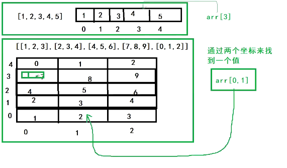

# Go数组切片

## 数组

### 什么是数组

- 一组数
  - 数组需要**相同类型**的集合
  - 数组是需要定义大小的
  - 数组一旦定义了大小是不可以改变的
  - 

### 数组的声明

```go
package main

import "fmt"

// 数组
func main() {
	// 数组定义
	// 数组也是一个数据类型
	// 数组的定义：[数组的大小]变量的类型
	var arr1 [5]int
	// 给数组赋值，所有的下标都是从0开始
	for i := 1; i <= 5; i++ {
		arr1[i-1] = i
	}
	// 打印数组
	fmt.Println(arr1)

	// 取出数组中的某个元素
	fmt.Println(arr1[0])

	// 数组中的常用方法：len()获取数组的长度，cap()获取数组的容量
	fmt.Println("数组的长度：", len(arr1))
	fmt.Println("数组的容量：", cap(arr1))
}

// 数组和其他变量没有什么区别, 唯一的就是这是一组数, 需要给一个大小 [5]int
// 数组是一个相同类型的有序集合,可以通过下标取出对应数据
```

### 数组的特点

1. 长度必须是确定的, 如果长度不确定就不是数组, 大小不可以改变
2. 元素必须是相同类型, 不能多个类型混合, [any也是一种类型, 可以存放任意类型的数据]
3. 数组中的元素类型, 可以是我们学的所有类型, int float string bool array....slice map

### 初始化数组的几种方式

```go
package main

import "fmt"

// 数组的赋值初始化

func main() {
	// 在定义数组的时候就直接初始化
	var arr1 = [5]int{1, 2, 3, 4, 5}
	fmt.Println(arr1)

	// 快速初始化
	arr2 := [5]int{1, 2, 3, 4, 5}
	fmt.Println(arr2)

	// 如果数组数据来自用户, 我不知道用户会给出多少数据, 我们要将其保存为数组
	// 使用 ... 代表数组的长度
	// Go 的编译器会自动根据数组的长度来给 ... 进行赋值 == 自动推导长度\
	// 注意点: 这里的数组不是无限长的,也是固定的大小, 大小取决于数组元素个数
	arr3 := [...]int{12, 342, 543, 1322, 654, 354, 12}
	fmt.Println(len(arr3))
	// 7

	// 数组默认值, 只给数组的某几个位置赋值 {index:值}
	var arr4 [10]int
	arr4 = [10]int{1: 100, 5: 500}
	fmt.Println(arr4)
	// [0 100 0 0 0 500 0 0 0 0]
}

```

### 遍历数组元素

```go
package main

import "fmt"

func main() {
	var arr = [5]int{1, 2, 3, 4, 5}

	// for 循环遍历数组
	for i := 0; i < len(arr); i++ {
		fmt.Println(arr[i])
	}

	// goland 快捷方式 数组.for  未来很多循环数组 切片很多时候都使用for range
	// for range 遍历数组
	// 就是将数组进行自动迭代, 返回两个值, index, value
	// 注意点: 如果只接受一个值, 这个时候返回的是数组的下标
	// 注意点: 如果只接受两个值, 这个时候返回的是数组的下标以及对应的值
	for index, value := range arr {
		fmt.Println("index: ", index, " value: ", value)
	}
	// 只输出value
	for _, value := range arr {
		fmt.Println("value: ", value)
	}
}

```

### 数组是值类型

```go
package main

import "fmt"

// 数组是值类型: 所有赋值后的对象修改值后不影响原来的对象
func main() {
	// 数组类型的样子: [size]type
	arr1 := [4]int{1, 2, 3, 4}
	arr2 := [5]string{"a", "b", "c", "d", "e"}
	fmt.Printf("%T\n", arr1) // [4]int
	fmt.Printf("%T\n", arr2) // [5]string

	// 数组的值传递和 int 等类型基本一致
	arr3 := arr1
	fmt.Println(arr1)
	fmt.Println(arr3)
	// 修改 arr3 观察 arr1 是否发生变化
	arr3[0] = 12
	fmt.Println(arr1)
	fmt.Println(arr3) // 数组是值传递, 拷贝一个新的内存空间
}

```

### 数组的排序

```go
arr := [6]int{1,2,3,4,5,0}
// 升序 ASC	：从小到大 0，1，2，3，4，5
// 降序 DESC	：从大到小 5，4，3，2，1，0
```

数组的排序，一组数是乱序的，我们如何将它按照升序或者降序排列

排序算法：冒泡排序、插入排序、选择排序、希尔、堆、快排.....

数据结构：数组就是最简单的数据结构之一

**冒泡排序**

```go
package main

import "fmt"

// 冒泡排序: 每次筛选出一个最大或者最小的数

/*
index 0   1    2    3    4
value 12  99   79   48   55
*/
// 冒泡排序的逻辑: 两两比较,大的往后移动获取往前移动
// 第一轮: 12 79 48 55 99 // 5
// 第二轮: 12 48 55 79 99 // 4
// 第三轮: 12 48 55 79 99 // 3
// 第四轮: 12 48 55 79 99 // 2
// 第五轮: 12 48 55 79 99 // 结束

func main() {
	arr := [5]int{12, 99, 79, 48, 55}
	for i := 0; i < len(arr); i++ {
		fmt.Println(i + 1)
		for j := 1; j < len(arr)-i; j++ {
			fmt.Println(j)
			// 将最大的数交换到后面
			if arr[j-1] > arr[j] {
				arr[j], arr[j-1] = arr[j-1], arr[j]
			}
		}
		fmt.Println(arr)
	}
	//fmt.Println(arr)

}
```

### 多维数组



```go
package main

import "fmt"

func main() {

    // 定义一个二维数组
    arr := [3][4]int{
       {0, 1, 2, 3},
       {4, 5, 6, 7},
       {8, 9, 10, 11},
    }
    // 二维数组: 一维数组存放的是一个数组
    fmt.Println(arr[0])
    // 要获取这个二维数组中的某个值,找到对应一维数组的坐标, arr[0] 当作一个整体
    fmt.Println(arr[0][1])

    // for 循环遍历二维数组
    for i := 0; i < len(arr); i++ {
       for j := 0; j < len(arr[i]); j++ {
          fmt.Printf("%d\t", arr[i][j])
       }
       fmt.Println()
    }
    // for range 遍历数组
    for i, v := range arr {
       fmt.Println(i, v)
    }
}
```

## 切片

Go 语言切片是对数组的抽象

**Go 语言的长度不可改变， 在特定的场景中这样的集合就不太适用**，Go 中提供了一种灵活、功能强悍的内置类型切片（“动态数组”），与数组相比切片的长度是不固定的，可以追加元素，在追加时可能使切片的容量增大。

切片是一种方便、灵活且强大的包装器，**切片本身没有任何数据，他们只是对现有数组的引用**。

切片与数组相比，**不需要设定长度**，在[]中不用设定值，相对来说比较自由

从概念上面来说slice像一个结构体，这个结构体包含了三个元素：

- 指针：指向数组中slice指定的开始位置
- 长度：即slice的长度
- 最大长度：也就是slice开始位置到数组的最后位置的长度

### 定义切片

```go
package main

import "fmt"

// 定义切片
func main() {
    arr := [4]int{1, 2, 3, 4} // 定长
    fmt.Println(arr)

    var s1 []int
    fmt.Println(s1)
    // 切片的空判断, 初始切片中默认是 nil
    if s1 == nil {
       fmt.Println("切片是空的")
    }
    s2 := []int{1, 2, 3, 4} // 切片 变长
    fmt.Println(s2)
    fmt.Printf("%T, %T\n", arr, s2) // [4]int, []int
    // 取出元素
    fmt.Println(s2[1])
}
```

### 通过make来创建切片

```go
package main

import "fmt"

func main() {
    // make()
    // make([]type, length, capacity)  // 创建一个切片需要长度, 容量
    s1 := make([]int, 5, 10)
    fmt.Println(s1)
    fmt.Println(len(s1), cap(s1))
    // 容量为10, 长队为5, 我能存放第6个数吗?
    //s1[6] = 200  // index out of range [6] with length 5 出现报错
    // 说明切片的底层还是数组
    // 直接去赋值是不行的, 不要使用惯性思维去思考
    
}
```

### 切片的扩容

```go
package main

import "fmt"

func main() {

    s1 := make([]int, 0, 5)
    fmt.Println(s1, len(s1), cap(s1))
    // 切片扩容, append()
    s1 = append(s1, 1, 2)
    fmt.Println(s1, len(s1), cap(s1))
    // 问题: 容量只有五个, 那可以放超过五个的吗?
    s1 = append(s1, 1, 2, 3, 4, 5)
    fmt.Println(s1, len(s1), cap(s1))
    // 答案显而易见是可以的, 切片会自动扩容

    // 切片扩容---引入另一个切片
    s2 := make([]int, 0, 5)
    s2 = append(s2, 100, 200)
    // 源码
    // slice = append(slice, anotherSlice...)
    // ... 在前面是可变参数 -- ...int
    // [...] 是根据长度变化数组的大小定义
    // anotherSlice... , slice...解构: 就是可以直接获取到slice中的所有元素
    // s2... = {100, 200}
    s1 = append(s1, s2...)
    fmt.Println(s1, len(s1), cap(s1))
}
```

### 遍历切片

```go
for i := 0; i < len(s1); i++ {
    fmt.Println(s1[i])
}
for i := range s1 {
    fmt.Println(s1[i])
}
```

### 扩容的内存分析

```go
package main

import "fmt"

func main() {

	s1 := []int{1, 2, 3}
	fmt.Println(s1)
	fmt.Printf("len:%d cap:%d \n", len(s1), cap(s1)) // len:3 cap:3
	fmt.Printf("%p\n", s1)                           // 0xc0000aa078

	s1 = append(s1, 4, 5)
	fmt.Printf("len:%d cap:%d \n", len(s1), cap(s1)) // len:5 cap:6
	fmt.Printf("%p\n", s1)                           // 0xc0000c8030

	s1 = append(s1, 6, 7, 8)
	fmt.Printf("len:%d cap:%d \n", len(s1), cap(s1)) // len:8 cap:12
	fmt.Printf("%p\n", s1)                           //0xc000086120

	s1 = append(s1, 9, 10)
	fmt.Printf("len:%d cap:%d \n", len(s1), cap(s1)) // len:10 cap:12
	fmt.Printf("%p\n", s1)                           // 0xc00001a240

	s1 = append(s1, 11, 12, 13, 14)
	fmt.Printf("len:%d cap:%d \n", len(s1), cap(s1)) // len:14 cap:24
	fmt.Printf("%p\n", s1)                           // 0xc000110000

	// 可以发现以下内容
	//1.cap 每次是成倍数增加的
	//2.只要容量扩容了, 地址就会发生变化

	// 结论
	// 1. 每个切片引用了一个底层的数组
	// 2. 切片本身不存储任何数据, 都是底层的数组来存储的, 所以修改了切片也就是修改了这个数组中的数据
	// 3. 向切片中添加数据的时候, 如果没有超过容量, 直接添加, 如果超过了这个容量, 就会自动扩容, 成倍的增加 -- copy方法
	// 4. 切片一旦扩容, 就是重新指向一个新的底层数组
}
```

copy方法

```go
package main

import "fmt"

func main() {
    numbers := []int{1, 2, 3, 4, 5, 6, 7, 8, 9, 10}
    fmt.Printf("len=%d cap=%d %v\n", len(numbers), cap(numbers), numbers)

    // 方法一: 直接使用make创建切片扩容
    numbers2 := make([]int, len(numbers), cap(numbers)*2)
    // 将原来的底层数据拷贝到新的数组中
    // func copy(dst, src []Type) int
    copy(numbers2, numbers)
    fmt.Printf("len=%d cap=%d %v\n", len(numbers2), cap(numbers2), numbers2)
}
```

补充：如果我们存放的数据大于切片的容量，在底层就会扩容 copy > 1024就不再是1倍了，而是1.25倍

### 通过数组来创建切片

```go
package main

import "fmt"

func main() {
    // 数组 [0, 10)
    // 数组的截取 arr[start:end)
    arr := [10]int{1, 2, 3, 4, 5, 6, 7, 8, 9, 10}

    // 通过数组来创建切片
    s1 := arr[:5] // 0-4 不包含5 注意这里面的数字指的是下标
    s2 := arr[3:8]
    s3 := arr[5:]
    s4 := arr[:]
    fmt.Println(s1)
    // [1 2 3 4 5]
    fmt.Println(s2)
    fmt.Println(s3)
    fmt.Println(s4)
    //查看长度和容量
    fmt.Printf("s1 len:%d, cap:%d\n", len(s1), cap(s1)) // s1 len:5, cap:10
    fmt.Printf("s2 len:%d, cap:%d\n", len(s2), cap(s2)) // s2 len:5, cap:7
    fmt.Printf("s3 len:%d, cap:%d\n", len(s3), cap(s3)) // s3 len:5, cap:5
    fmt.Printf("s4 len:%d, cap:%d\n", len(s4), cap(s4)) // s4 len:10, cap:10

    // 内存地址
    fmt.Printf("%p\n", s1)      // 0xc000012640
    fmt.Printf("%p\n", s2)      // 0xc000012658
    fmt.Printf("%p\n", s3)      // 0xc000012668
    fmt.Printf("%p\n", &arr[5]) // 0xc000012668
    fmt.Printf("%p\n", s4)      // 0xc000012640
    fmt.Printf("%p\n", &arr)    // 0xc000012640

    // 可以发现容量发生改变(就是从中间截断), 就不再指向原来的数组地址了, 指向最新截断的下标元素开始, 而容量不变的还是指向原来的地址
    // cap的大小就是从arr[start:end]中的start到末尾的长度, len大小就是切片的长度

    // 修改数组的内容,切片本身也会发生变化
    arr[4] = 100
    fmt.Println(arr)
    fmt.Println(s1)
    fmt.Println(s2)
    fmt.Println(s3)
    fmt.Println(s4)
    // 修改切片的内容数组也会随之变化
    s2[2] = 80
    fmt.Println(arr)
    fmt.Println(s1)
    fmt.Println(s2)
    fmt.Println(s3)
    fmt.Println(s4)
    fmt.Println("---------------")
    // 如果在切片容量内添加数据, 会导致原来的数组数据发生修改. 只有在扩容之后, 才会导致底层数组会产生拷贝变为新的数组
    s1 = append(s1, 11, 12, 13, 14, 15, 16)
    fmt.Println(arr) // [1 2 3 4 100 80 7 8 9 10]
    fmt.Println(s1)  // [1 2 3 4 100 11 12 13 14 15 16]
    fmt.Println(s2)  // [4 100 80 7 8]
    fmt.Println(s3)  // [80 7 8 9 10]

    // 打印内存地址, 可以发现已经不是同一个地址了
    fmt.Printf("%p\n", s1)
    fmt.Printf("%p\n", &arr)
}
```

### 切片：引用类型

```go
package main

import "fmt"

func main() {
    // 值类型, 传递: copy
    arr1 := [4]int{1, 2, 3, 4}
    arr2 := arr1
    fmt.Println(arr1, arr2)
    arr1[0] = 100
    fmt.Println(arr1, arr2)
    // arr2没有发生改变

    // 切片: 引用类型
    s1 := []int{1, 2, 3, 4}
    s2 := s1
    fmt.Println(s1, s2)
    s1[0] = 100
    fmt.Println(s1, s2)
    // 两个切片都发生了改变
    // s1 和 s2 的底层地址是一样的
    fmt.Printf("%p\n", s1)
    fmt.Printf("%p\n", s2)
}
```

### 深拷贝、浅拷贝

深拷贝：拷贝是数据的本身

- 值类型的数据，默认都是深拷贝，array、int、float、string、bool、struct.....

浅拷贝：拷贝的是数据的地址，会导致多个变量指向同一块内存

- 引用类型的数据：slice、map
- 因为切片是引用类型的数据，直接拷贝的是这个地址

> 切片怎么实现深拷贝？

```go
package main

import "fmt"

// 切片实现深拷贝
func main() {
	// 将原来切片中的数据拷贝到新的切片中
	s1 := []int{1, 2, 3, 4}
	s2 := make([]int, 0) // len:0 cap:0
	for i := 0; i < len(s1); i++ {
		s2 = append(s2, s1[i])
	}
	fmt.Println(s1, s2)
	s1[0] = 100
	fmt.Println(s1)
	fmt.Println(s2)
	// 互不影响
	fmt.Println("-----------")
	// 使用copy方法
	s3 := []int{5, 6, 7}
	fmt.Println(s2)
	fmt.Println(s3)
	// 将s3中的元素拷贝到s2中
	copy(s2, s3)
	fmt.Println(s2)
	fmt.Println(s3)
	// 不会自动去扩容, 只会修改可以修改的值
}

```

### 函数中参数传递问题

#### 函数补充

**在使用函数的时候，一定要特别注意参数问题，如果是值类型的，很多传递是无效的**

一些值传递类型的参数，如果我们想通过函数来进行修改对应的值，这个时候就需要使用**指针**

指针变量：指向原来变量的地址

> 切片其实就是一个特殊的指针

```go
package main

import "fmt"

func main() {
    arr1 := [4]int{1, 2, 3, 4}
    fmt.Println("start arr1:", arr1)
    update(arr1)
    fmt.Println("end arr1:", arr1)

    s1 := []int{1, 2, 3, 4}
    fmt.Println("start s1:", s1)
    update2(s1)
    fmt.Println("end s1:", s1)
}

// 数组是值类型的
func update(arr [4]int) {
    fmt.Println("func arr:", arr)
    arr[1] = 100
    fmt.Println("func arr end:", arr)
}

// 切片是引用类型的
func update2(s []int) {
    fmt.Println("func slice:", s)
    s[1] = 100
    fmt.Println("func slice end:", s)
}
```

## Map

**map是一种无序的键值对的集合**

- 无序：map[key]
- 键值对：key-value

map最重要的一点是通过key来快速检索数据，key类似于索引，指向数据的值

map是一种集合，所以我们可以像迭代数组和切片那样迭代它

不过map是无序的，我们无法决定它的返回顺序

map也是**引用类型**

### map的定义

```go
package main

import "fmt"

// map 集合, 保存数据的一种结构
func main() {
    // 创建一个 map, 也是一个变量, 数据类型是 map
    // map[key]value
    var map1 map[int]string // 1:"Java", 这边只是声明了但是没有初始化
    if map1 == nil {
       fmt.Println("map1 == nil")
    }
    // 更多的时候使用make方法创建
    var map2 = make(map[string]string) // 创建了map
    fmt.Println(map1)
    fmt.Println(map2)

    // 在创建的时候添加一些基础数据
    var map3 = map[string]int{"Go": 100, "Java": 10, "C": 60}
    fmt.Println(map3)        // map[C:60 Go:100 Java:10]
    fmt.Printf("%T\n", map3) // map[string]int

}
```

### map的使用

- 创建并初始化map
- map[key] = value. 将value赋值给对应的map的key
- 判断key是否存在, value, ok := map[key]
- 删除map中的元素, delete(map, key)
- 新增map[key] = value
- 修改map[key] = value, 如果存在这个key就是修改
- 查看map的长度len(map)

```go
package main

import "fmt"

// map 的使用
// var map1 map[key]value   make(map[key]value)
func main() {
    // 创建 map
    var map1 map[int]string // nil 是不可以使用的, 仅仅只是声明了, 还没有初始化
    // 给 map1 赋值
    // 初始化 map
    map1 = make(map[int]string)
    // 在 map 中如果你的key重复了, 他就会覆盖掉这个 key 原来的值
    map1[100] = "a"
    map1[200] = "b"
    map1[300] = "b"
    map1[100] = "c"
    // 获取数据
    fmt.Println(map1)
    fmt.Println(map1[200])
    fmt.Println(map1[1]) // 不存在, 默认值为 string ""

    // map 中, 没有 index 下标, 有时候我们取值就需要判断这个 key 是否存在了
    // map 中的判断, ok-idiom 是否存在
    // value = map[key], 存在隐藏的返回值 ok-idiom, 可选参数
    value, ok := map1[1]
    if ok {
       fmt.Println("map key 存在的, value:", value)
    } else {
       fmt.Println("map key 不存在的")
    }

    // 修改数据
    map1[100] = "Elm"
    fmt.Println(map1)
    // 如果数据存在, 那么就会修改它, 如果不存在, 就会创建对应的 key-value
    map1[1] = "xxxxxxxxx"
    fmt.Println(map1)
    fmt.Println(len(map1))
    // map中的数据如何删除?
    // delete(map, key)
    delete(map1, 1)
    fmt.Println(map1)
    // map 的大小
    fmt.Println(len(map1))
}
```

### map遍历

1.无序的遍历map可能每次的结果排序都不一致
2.map 的长度是不固定的, 和 slice 差不多, 是引用类型
3.len可以用于查看map中数据的数量, 但是cap无法使用
4.map的key可以是所有可以比较的类型. bool int float...

```go
package main

import "fmt"

/*
    遍历map
    - key  value
    - "aaa"    "aaaaa"
    - "bbb"    "bbbbb"
    - "ccc"    "ccccc"
    - "ddd"    "ddddd"
*/

func main() {
    var map1 = map[string]int{"Go": 100, "Java": 99, "C": 80, "Python": 60}
    // 循环遍历  只能通过 for range
    for k, v := range map1 {
       fmt.Println(k, v)
    }
}
```

### map结合slice使用

```go
package main

import "fmt"

// map 结合 slice 来使用
/*
需求:
1. 创建 map 来存储人的信息: name age sex addr
2. 每个 map 保存一个人的信息
3. 将这些 map 存入到切片中
4. 打印这些数据
*/

func main() {
    user1 := make(map[string]string)
    user1["name"] = "Elm"
    user1["age"] = "18"
    user1["sex"] = "male"
    user1["addr"] = "Fuzhou"

    user2 := make(map[string]string)
    user2["name"] = "wuliao"
    user2["age"] = "20"
    user2["sex"] = "male"
    user2["addr"] = "Putian"

    // 2 个数据有了, 存放到切片中, 供我们使用 0 1
    userDatas := make([]map[string]string, 0, 2)
    userDatas = append(userDatas, user1)
    userDatas = append(userDatas, user2)
    for i, user := range userDatas {
       fmt.Println(i)
       fmt.Println(user)
    }

}
```